### 0.0 Introduction  

Part 1: Sample Variable Distribution (15 Feb 2023)

Here, we're going to go through what our raw data (`eDat`) and clinical data (`pDat`) looks like by making plots depicting the spread and variability of our data.   

*Ps: I want you to add your own notes throughout the script to ensure that if you ever came back to run this analysis again, you understand in your own words what function you're performing*  

We're also going to be making a new type of sample information dataframe called `mDat`. mDat (or metadata) stores all of the sample relevant information that it not phenotypic/clinical data  

***  

### 1.0 Loading Packages and Data  

Loading all of our packages:  


```r
# rmarkdown packages
library(knitr) 
library(rmarkdown)

# data wrangling packages
library(tidyverse)
library(janitor)
library(stringr)
library(ggplot2)
library(viridis)

# data loading packages
library(readxl) 
library(openxlsx)
library(here)


# setting global script options - i.e, parameters/arguents that will be applied to all chunks, without having to explicity specify them each time
knitr::opts_chunk$set(warning = FALSE, message = FALSE, error = FALSE)
```

Reading in data:  


```r
# setwd("F:/Katya/Oncofetal_kidney/data")
# #ask Nikita about the here::here
# 
# getwd()
# #pDat <- here::here(read_excel( "KIRC_pDat_replicates_removed.xlsx"))
# #was not working for me unless i specified the full file path 
pDat <- read_excel("F:/Katya/Oncofetal_kidney/data/KIRC_pDat_replicates_removed.xlsx")
eDat <- read_rds("F:/Katya/Oncofetal_kidney/data/KIRC_eDat_replicates_removed.RDS")

# # 
#For Desktop:
# pDat <- read_excel(here::here("data", "KIRC_pDat_replicates_removed.xlsx"))
# eDat <- read_rds(here::here("data", "KIRC_eDat_replicates_removed.RDS"))

#pDat2 <- read_excel(here::here("BIOL_448", "KIRC_pDat_replicates_removed.xlsx"))

# For my mac:
# pDat <- read_excel("/Users/Katya/Desktop/BIOL_448/KIRC_pDat_replicates_removed.xlsx")
# eDat <- read_rds("/Users/Katya/Desktop/BIOL_448/KIRC_eDat_replicates_removed.RDS", refhook = NULL)


# text below is not necessary 
# eDat_mirs <- read_excel("/Users/Katya/Desktop/BIOL_448/eDat_known_mirs.xlsx")
# eFil <- read_rds("/Users/Katya/Desktop/BIOL_448/KIRC_eDat_replicates_removed.RDS", refhook = NULL)

# what is the difference between eFil all mirs and eDat known mirs?
# are the known mirs the miRNAs that are known to be aberrantly expressed in cancer?

# what does the refhook = NULL do ?
```

**Replace the NAs in `Self_reported_race` with the value "not reported"**  


```r
pDat$Self_reported_race <- pDat$Self_reported_race %>% 
  replace_na("Not Reported")
```


```r
### --> Let's make condition specific pDats - we might need them later on

pDat_tumour <- pDat %>% 
  filter(Condition == "Tumour")

pDat_nm <- pDat %>% 
  filter(Condition == "NM")

pDat_fetal <- pDat %>% 
  filter(Condition == "Fetal")
#separate all 


# add a column in pDat for whether samples are matched or not
# if the sample has a normal and a tumor as well - from the same patient 
# 
# pDat <- pDat %>% 
#   dplyr::count(Case_ID) %>% 
#   filter(n > 1) %>% 
#   
# if (pDat$Case_ID )
# 
# %>% 
#   mutate()
# 
# pDat %>% 
#   mutate(matched = )
# 
# n_occur <- data.frame(table(pDat$Case_ID))
# 
# if (n_occur$Freq > 1) {
#   mutate()
# }
# 
# pDat <- cbind(pDat, matched = n_occur$Freq)
#  
  #if matched, make a new column saying yes, if not put no in the column 

matched <- pDat %>% 
  dplyr::count(Case_ID) %>% 
  filter(n >=2) %>% 
  dplyr::select(-n) %>% 
  mutate(Matched = "Yes") 

pDat <- pDat %>% 
  left_join(matched, by = "Case_ID")

pDat$Matched <- ifelse(is.na(pDat$Matched), "No", pDat$Matched)
```

***

### 2.0 Summary Statistics  

#### 2.1 Samples  

Let's check how our clinical variables are spread within our data


```r
#install.packages("cli")
#no need to install - error resolved by updating version of R studio

library(gtsummary)

pDat %>% 
  dplyr::select(Sex, Condition, Self_reported_race) %>% 
  tbl_summary(by = Condition)
```

```{=html}
<div id="zcjxumhpla" style="padding-left:0px;padding-right:0px;padding-top:10px;padding-bottom:10px;overflow-x:auto;overflow-y:auto;width:auto;height:auto;">
<style>html {
  font-family: -apple-system, BlinkMacSystemFont, 'Segoe UI', Roboto, Oxygen, Ubuntu, Cantarell, 'Helvetica Neue', 'Fira Sans', 'Droid Sans', Arial, sans-serif;
}

#zcjxumhpla .gt_table {
  display: table;
  border-collapse: collapse;
  margin-left: auto;
  margin-right: auto;
  color: #333333;
  font-size: 16px;
  font-weight: normal;
  font-style: normal;
  background-color: #FFFFFF;
  width: auto;
  border-top-style: solid;
  border-top-width: 2px;
  border-top-color: #A8A8A8;
  border-right-style: none;
  border-right-width: 2px;
  border-right-color: #D3D3D3;
  border-bottom-style: solid;
  border-bottom-width: 2px;
  border-bottom-color: #A8A8A8;
  border-left-style: none;
  border-left-width: 2px;
  border-left-color: #D3D3D3;
}

#zcjxumhpla .gt_heading {
  background-color: #FFFFFF;
  text-align: center;
  border-bottom-color: #FFFFFF;
  border-left-style: none;
  border-left-width: 1px;
  border-left-color: #D3D3D3;
  border-right-style: none;
  border-right-width: 1px;
  border-right-color: #D3D3D3;
}

#zcjxumhpla .gt_caption {
  padding-top: 4px;
  padding-bottom: 4px;
}

#zcjxumhpla .gt_title {
  color: #333333;
  font-size: 125%;
  font-weight: initial;
  padding-top: 4px;
  padding-bottom: 4px;
  padding-left: 5px;
  padding-right: 5px;
  border-bottom-color: #FFFFFF;
  border-bottom-width: 0;
}

#zcjxumhpla .gt_subtitle {
  color: #333333;
  font-size: 85%;
  font-weight: initial;
  padding-top: 0;
  padding-bottom: 6px;
  padding-left: 5px;
  padding-right: 5px;
  border-top-color: #FFFFFF;
  border-top-width: 0;
}

#zcjxumhpla .gt_bottom_border {
  border-bottom-style: solid;
  border-bottom-width: 2px;
  border-bottom-color: #D3D3D3;
}

#zcjxumhpla .gt_col_headings {
  border-top-style: solid;
  border-top-width: 2px;
  border-top-color: #D3D3D3;
  border-bottom-style: solid;
  border-bottom-width: 2px;
  border-bottom-color: #D3D3D3;
  border-left-style: none;
  border-left-width: 1px;
  border-left-color: #D3D3D3;
  border-right-style: none;
  border-right-width: 1px;
  border-right-color: #D3D3D3;
}

#zcjxumhpla .gt_col_heading {
  color: #333333;
  background-color: #FFFFFF;
  font-size: 100%;
  font-weight: normal;
  text-transform: inherit;
  border-left-style: none;
  border-left-width: 1px;
  border-left-color: #D3D3D3;
  border-right-style: none;
  border-right-width: 1px;
  border-right-color: #D3D3D3;
  vertical-align: bottom;
  padding-top: 5px;
  padding-bottom: 6px;
  padding-left: 5px;
  padding-right: 5px;
  overflow-x: hidden;
}

#zcjxumhpla .gt_column_spanner_outer {
  color: #333333;
  background-color: #FFFFFF;
  font-size: 100%;
  font-weight: normal;
  text-transform: inherit;
  padding-top: 0;
  padding-bottom: 0;
  padding-left: 4px;
  padding-right: 4px;
}

#zcjxumhpla .gt_column_spanner_outer:first-child {
  padding-left: 0;
}

#zcjxumhpla .gt_column_spanner_outer:last-child {
  padding-right: 0;
}

#zcjxumhpla .gt_column_spanner {
  border-bottom-style: solid;
  border-bottom-width: 2px;
  border-bottom-color: #D3D3D3;
  vertical-align: bottom;
  padding-top: 5px;
  padding-bottom: 5px;
  overflow-x: hidden;
  display: inline-block;
  width: 100%;
}

#zcjxumhpla .gt_group_heading {
  padding-top: 8px;
  padding-bottom: 8px;
  padding-left: 5px;
  padding-right: 5px;
  color: #333333;
  background-color: #FFFFFF;
  font-size: 100%;
  font-weight: initial;
  text-transform: inherit;
  border-top-style: solid;
  border-top-width: 2px;
  border-top-color: #D3D3D3;
  border-bottom-style: solid;
  border-bottom-width: 2px;
  border-bottom-color: #D3D3D3;
  border-left-style: none;
  border-left-width: 1px;
  border-left-color: #D3D3D3;
  border-right-style: none;
  border-right-width: 1px;
  border-right-color: #D3D3D3;
  vertical-align: middle;
  text-align: left;
}

#zcjxumhpla .gt_empty_group_heading {
  padding: 0.5px;
  color: #333333;
  background-color: #FFFFFF;
  font-size: 100%;
  font-weight: initial;
  border-top-style: solid;
  border-top-width: 2px;
  border-top-color: #D3D3D3;
  border-bottom-style: solid;
  border-bottom-width: 2px;
  border-bottom-color: #D3D3D3;
  vertical-align: middle;
}

#zcjxumhpla .gt_from_md > :first-child {
  margin-top: 0;
}

#zcjxumhpla .gt_from_md > :last-child {
  margin-bottom: 0;
}

#zcjxumhpla .gt_row {
  padding-top: 8px;
  padding-bottom: 8px;
  padding-left: 5px;
  padding-right: 5px;
  margin: 10px;
  border-top-style: solid;
  border-top-width: 1px;
  border-top-color: #D3D3D3;
  border-left-style: none;
  border-left-width: 1px;
  border-left-color: #D3D3D3;
  border-right-style: none;
  border-right-width: 1px;
  border-right-color: #D3D3D3;
  vertical-align: middle;
  overflow-x: hidden;
}

#zcjxumhpla .gt_stub {
  color: #333333;
  background-color: #FFFFFF;
  font-size: 100%;
  font-weight: initial;
  text-transform: inherit;
  border-right-style: solid;
  border-right-width: 2px;
  border-right-color: #D3D3D3;
  padding-left: 5px;
  padding-right: 5px;
}

#zcjxumhpla .gt_stub_row_group {
  color: #333333;
  background-color: #FFFFFF;
  font-size: 100%;
  font-weight: initial;
  text-transform: inherit;
  border-right-style: solid;
  border-right-width: 2px;
  border-right-color: #D3D3D3;
  padding-left: 5px;
  padding-right: 5px;
  vertical-align: top;
}

#zcjxumhpla .gt_row_group_first td {
  border-top-width: 2px;
}

#zcjxumhpla .gt_summary_row {
  color: #333333;
  background-color: #FFFFFF;
  text-transform: inherit;
  padding-top: 8px;
  padding-bottom: 8px;
  padding-left: 5px;
  padding-right: 5px;
}

#zcjxumhpla .gt_first_summary_row {
  border-top-style: solid;
  border-top-color: #D3D3D3;
}

#zcjxumhpla .gt_first_summary_row.thick {
  border-top-width: 2px;
}

#zcjxumhpla .gt_last_summary_row {
  padding-top: 8px;
  padding-bottom: 8px;
  padding-left: 5px;
  padding-right: 5px;
  border-bottom-style: solid;
  border-bottom-width: 2px;
  border-bottom-color: #D3D3D3;
}

#zcjxumhpla .gt_grand_summary_row {
  color: #333333;
  background-color: #FFFFFF;
  text-transform: inherit;
  padding-top: 8px;
  padding-bottom: 8px;
  padding-left: 5px;
  padding-right: 5px;
}

#zcjxumhpla .gt_first_grand_summary_row {
  padding-top: 8px;
  padding-bottom: 8px;
  padding-left: 5px;
  padding-right: 5px;
  border-top-style: double;
  border-top-width: 6px;
  border-top-color: #D3D3D3;
}

#zcjxumhpla .gt_striped {
  background-color: rgba(128, 128, 128, 0.05);
}

#zcjxumhpla .gt_table_body {
  border-top-style: solid;
  border-top-width: 2px;
  border-top-color: #D3D3D3;
  border-bottom-style: solid;
  border-bottom-width: 2px;
  border-bottom-color: #D3D3D3;
}

#zcjxumhpla .gt_footnotes {
  color: #333333;
  background-color: #FFFFFF;
  border-bottom-style: none;
  border-bottom-width: 2px;
  border-bottom-color: #D3D3D3;
  border-left-style: none;
  border-left-width: 2px;
  border-left-color: #D3D3D3;
  border-right-style: none;
  border-right-width: 2px;
  border-right-color: #D3D3D3;
}

#zcjxumhpla .gt_footnote {
  margin: 0px;
  font-size: 90%;
  padding-left: 4px;
  padding-right: 4px;
  padding-left: 5px;
  padding-right: 5px;
}

#zcjxumhpla .gt_sourcenotes {
  color: #333333;
  background-color: #FFFFFF;
  border-bottom-style: none;
  border-bottom-width: 2px;
  border-bottom-color: #D3D3D3;
  border-left-style: none;
  border-left-width: 2px;
  border-left-color: #D3D3D3;
  border-right-style: none;
  border-right-width: 2px;
  border-right-color: #D3D3D3;
}

#zcjxumhpla .gt_sourcenote {
  font-size: 90%;
  padding-top: 4px;
  padding-bottom: 4px;
  padding-left: 5px;
  padding-right: 5px;
}

#zcjxumhpla .gt_left {
  text-align: left;
}

#zcjxumhpla .gt_center {
  text-align: center;
}

#zcjxumhpla .gt_right {
  text-align: right;
  font-variant-numeric: tabular-nums;
}

#zcjxumhpla .gt_font_normal {
  font-weight: normal;
}

#zcjxumhpla .gt_font_bold {
  font-weight: bold;
}

#zcjxumhpla .gt_font_italic {
  font-style: italic;
}

#zcjxumhpla .gt_super {
  font-size: 65%;
}

#zcjxumhpla .gt_footnote_marks {
  font-style: italic;
  font-weight: normal;
  font-size: 75%;
  vertical-align: 0.4em;
}

#zcjxumhpla .gt_asterisk {
  font-size: 100%;
  vertical-align: 0;
}

#zcjxumhpla .gt_indent_1 {
  text-indent: 5px;
}

#zcjxumhpla .gt_indent_2 {
  text-indent: 10px;
}

#zcjxumhpla .gt_indent_3 {
  text-indent: 15px;
}

#zcjxumhpla .gt_indent_4 {
  text-indent: 20px;
}

#zcjxumhpla .gt_indent_5 {
  text-indent: 25px;
}
</style>
<table class="gt_table">
  
  <thead class="gt_col_headings">
    <tr>
      <th class="gt_col_heading gt_columns_bottom_border gt_left" rowspan="1" colspan="1" scope="col" id="&lt;strong&gt;Characteristic&lt;/strong&gt;"><strong>Characteristic</strong></th>
      <th class="gt_col_heading gt_columns_bottom_border gt_center" rowspan="1" colspan="1" scope="col" id="&lt;strong&gt;Fetal&lt;/strong&gt;, N = 10&lt;sup class=&quot;gt_footnote_marks&quot;&gt;1&lt;/sup&gt;"><strong>Fetal</strong>, N = 10<sup class="gt_footnote_marks">1</sup></th>
      <th class="gt_col_heading gt_columns_bottom_border gt_center" rowspan="1" colspan="1" scope="col" id="&lt;strong&gt;NM&lt;/strong&gt;, N = 71&lt;sup class=&quot;gt_footnote_marks&quot;&gt;1&lt;/sup&gt;"><strong>NM</strong>, N = 71<sup class="gt_footnote_marks">1</sup></th>
      <th class="gt_col_heading gt_columns_bottom_border gt_center" rowspan="1" colspan="1" scope="col" id="&lt;strong&gt;Tumour&lt;/strong&gt;, N = 484&lt;sup class=&quot;gt_footnote_marks&quot;&gt;1&lt;/sup&gt;"><strong>Tumour</strong>, N = 484<sup class="gt_footnote_marks">1</sup></th>
    </tr>
  </thead>
  <tbody class="gt_table_body">
    <tr><td headers="label" class="gt_row gt_left">Sex</td>
<td headers="stat_1" class="gt_row gt_center"></td>
<td headers="stat_2" class="gt_row gt_center"></td>
<td headers="stat_3" class="gt_row gt_center"></td></tr>
    <tr><td headers="label" class="gt_row gt_left">    F</td>
<td headers="stat_1" class="gt_row gt_center">4 (40%)</td>
<td headers="stat_2" class="gt_row gt_center">0 (0%)</td>
<td headers="stat_3" class="gt_row gt_center">0 (0%)</td></tr>
    <tr><td headers="label" class="gt_row gt_left">    Female</td>
<td headers="stat_1" class="gt_row gt_center">0 (0%)</td>
<td headers="stat_2" class="gt_row gt_center">19 (27%)</td>
<td headers="stat_3" class="gt_row gt_center">166 (34%)</td></tr>
    <tr><td headers="label" class="gt_row gt_left">    M</td>
<td headers="stat_1" class="gt_row gt_center">6 (60%)</td>
<td headers="stat_2" class="gt_row gt_center">0 (0%)</td>
<td headers="stat_3" class="gt_row gt_center">0 (0%)</td></tr>
    <tr><td headers="label" class="gt_row gt_left">    Male</td>
<td headers="stat_1" class="gt_row gt_center">0 (0%)</td>
<td headers="stat_2" class="gt_row gt_center">52 (73%)</td>
<td headers="stat_3" class="gt_row gt_center">318 (66%)</td></tr>
    <tr><td headers="label" class="gt_row gt_left">Self_reported_race</td>
<td headers="stat_1" class="gt_row gt_center"></td>
<td headers="stat_2" class="gt_row gt_center"></td>
<td headers="stat_3" class="gt_row gt_center"></td></tr>
    <tr><td headers="label" class="gt_row gt_left">    asian</td>
<td headers="stat_1" class="gt_row gt_center">0 (0%)</td>
<td headers="stat_2" class="gt_row gt_center">0 (0%)</td>
<td headers="stat_3" class="gt_row gt_center">7 (1.4%)</td></tr>
    <tr><td headers="label" class="gt_row gt_left">    black or african american</td>
<td headers="stat_1" class="gt_row gt_center">0 (0%)</td>
<td headers="stat_2" class="gt_row gt_center">2 (2.8%)</td>
<td headers="stat_3" class="gt_row gt_center">42 (8.7%)</td></tr>
    <tr><td headers="label" class="gt_row gt_left">    not reported</td>
<td headers="stat_1" class="gt_row gt_center">0 (0%)</td>
<td headers="stat_2" class="gt_row gt_center">3 (4.2%)</td>
<td headers="stat_3" class="gt_row gt_center">5 (1.0%)</td></tr>
    <tr><td headers="label" class="gt_row gt_left">    Not Reported</td>
<td headers="stat_1" class="gt_row gt_center">10 (100%)</td>
<td headers="stat_2" class="gt_row gt_center">0 (0%)</td>
<td headers="stat_3" class="gt_row gt_center">0 (0%)</td></tr>
    <tr><td headers="label" class="gt_row gt_left">    white</td>
<td headers="stat_1" class="gt_row gt_center">0 (0%)</td>
<td headers="stat_2" class="gt_row gt_center">66 (93%)</td>
<td headers="stat_3" class="gt_row gt_center">430 (89%)</td></tr>
  </tbody>
  
  <tfoot class="gt_footnotes">
    <tr>
      <td class="gt_footnote" colspan="4"><sup class="gt_footnote_marks">1</sup> n (%)</td>
    </tr>
  </tfoot>
</table>
</div>
```

```r
# modify this table so Female = F, Male = M, not reported = Not Reported 
```

Let's replace the lower case words in `Self_reported_race` to capitals i.e., 'black or african american' to 'Black or African American'  

**Use the `case_when` function to replace the values within the Self_reported_race column**  


```r
# condition_1 <- "black or african american"
# condition_2 <- "white"
# condition_3 <- "not reported"

# pDat$Self_reported_race %>% 
#   case_when(
#     pDat$Self_reported_race == condition_1 ~ 'Black or African American',
#     pDat$Self_reported_race == condition_2 ~ 'White',
#     pDat$Self_reported_race == condition_3 ~ 'Not Reported',
#     TRUE ~ 'NA'
#   )

# produces this:

# # Error in `case_when()`:
# ! Case 1 (`.`) must be a two-sided formula, not a character vector.
# Backtrace:
#  1. pDat$Self_reported_race %>% ...
#  2. dplyr::case_when(...)
# 
# pDat<- pDat %>% 
#   sub("black or african american", "Black or African American", pDat)

# pDat<- pDat$Self_reported_race %>% 
#   str_to_title( locale = "en")

# pDat <- pDat$Self_reported_race %>% 
#   replace(pDat$Self_reported_race == "white",  "White")
# #turns entire pDat into character list 

pDat$Self_reported_race[pDat$Self_reported_race == "white"]<-"White"
pDat$Self_reported_race[pDat$Self_reported_race == "black or african american"]<-"Black or African American"
pDat$Self_reported_race[pDat$Self_reported_race == "not reported"]<-"Not Reported"
pDat$Self_reported_race[pDat$Self_reported_race == "asian"]<-"Asian"

# had to comment out while knitting -> there was an error
# pDat %>% 
#   dplyr::select(Sex, Condition, Self_reported_race) %>% 
#   tbl_summary(by = Condition)

#use case_when to make m = male, f = female etc 
```

**Q: Do you think it's important to take note of the distribution of the samples per sex? Is there a higher incidence of renal cancer in one sex versus the other?**  

A:  
  Yes, there is a higher incidence of renal cancer in males than in females. It's important to note the distribution across each sex, as some miRNAs may exhibit higher aberrant expressions in one sex exclusively, but not across both -> the results may be masked when looking at distributions across all sexes at once. 
  
**Q: Given that there's a very low number of samples that are not self-reported Caucasian, do you think we should include or exclude the non-Caucasian samples? Either choice is valid, but write down your explanation and justification of your choice**    
**Reformat your eDat and pDat if you decide to exclude them**   

A:   There is a need to study more diverse sample groups run statistical analyses to see if miRNA expressions vary across self-reported race. However, since there is such a small amount of diversity in these samples, I think I should include them and then just make a note of the lack of diversity and look into how self-reported race may skew distributions, if at all 

after review : small number of samples -> such little expression, won't skew the distribution enough to produce significant results, can remove samples to make the data set more homogeneous but including them won't drastically change the overall results, their expression differences will be negligible 
n = 30 is usually the baseline 
  
  
Let's now make some plots so visualise the spread of our samples by the clinical variables that we have. We're going to use the `ggplot2` package for plotting.  

`ggplot2` (the Grammar of Graphics) package is used to make graphs in R, where it has the following necessary components:  

- `aes` = aesthetics = your x and y axes, and any additional variables you want to visualize your data by  
- `geoms` = the type to graph you want to plot (e.g., bar plot = geom_bar, scatter plot = geom_point, etc.)  

Let's see the number of samples we have by condition by making a bar graph


```r
pDat %>% 
  ggplot(aes(x = Condition, fill = Condition)) + 
  # the plus sign is how you add additional arguments/components to your ggplot  
  # fill = variable you want to colour by 
  geom_bar(stat = "count") +
  # because we want to count the number of samples, we specify `count`. If we had denoted a y-axis, we would use stat = "identity"
  labs(title = "KIRC Summary Statistics", y = "No. of Samples")
```

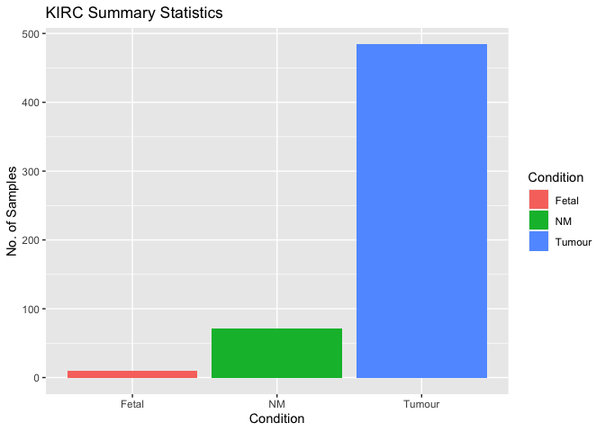<!-- -->

```r
  # labels of our plot
```


Hmm, I'd like to change:  

- the order of the columns, so that Tumour is first, NM is second, and Fetal is last  
- the colours assigned to the 3 condition variables  

Let's apply those changes:    

1. To reorder the columns, we have to reorder the variable itself. In R, an ordered variable is called a *factor*. We can specify the order of the attributes within a variable (called the levels of that factor) using the `fct_relevel`function.  

`mutate` is used when we want to make a new column, or want to overwrite an existing column  


```r
# changing and overwriting Condition from a character to a factor, and setting its levels

pDat <- pDat %>% 
  mutate(Condition = as.factor(Condition)) %>% 
  mutate(Condition = fct_relevel(Condition, c("Tumour", "NM", "Fetal")))
```


2. Let's also make a custom colour palette for our variables. I've made my own colour palette (the one I use in my KIRC project), **but tweak it and add your own colours per variable**  


```r
colpal <- list(Condition = c(`Fetal` = "#ECB576", `NM` = "#115363", `Tumour` = "#A34237"),
               Sex = c(`Male` = "#E05D5D", `Female` = "#ffb708"),
               Self_reported_race = c(`Black or African American` = "#9BBC49", 
                                      `Asian` = "#5B8D33", 
                                      `White` = "#286E16", 
                                      `Not Reported` = "#666666"))
```

Making the above plot with our ordered factor variable and custom colour palette:  


```r
pDat %>% 
  ggplot(aes(x = Condition, fill = Condition)) + 
  geom_bar(stat = "count", width = 0.5) +
  scale_fill_manual(values = colpal$Condition) +
  labs(title = "KIRC Summary Statistics", y = "No. of Samples") +
  theme_minimal()
```

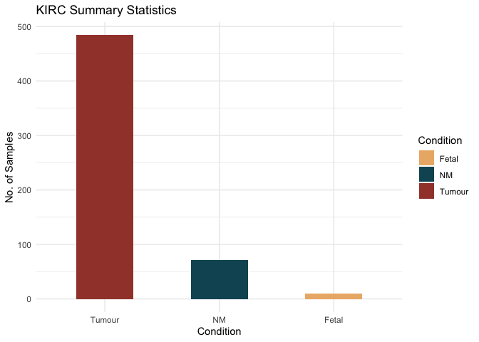<!-- -->

**Make similar bar graphs, this time for sex and self-reported race**  


```r
pDat <- pDat %>% 
  mutate(Sex = as.factor(Sex)) %>% 
  mutate(Sex = fct_relevel(Sex, c("Male", "M", "Female", "F")))

#figure ou how to combine Male + M and female + F 

pDat %>% 
  ggplot(aes(x = Sex, fill = Sex)) + 
  # the plus sign is how you add additional arguments/components to your ggplot  
  # fill = variable you want to colour by 
  geom_bar(stat = "count") +
   # scale_fill_manual(values = colpal$Condition) +
  # because we want to count the number of samples, we specify `count`. If we had denoted a y-axis, we would use stat = "identity"
  labs(title = "KIRC Summary Statistics", y = "No. of Samples") #+
```

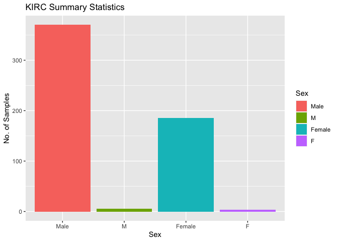<!-- -->

```r
   # theme_minimal()
  # labels of our plot
```


```r
pDat <- pDat %>% 
  mutate(Self_reported_race = as.factor(Self_reported_race)) %>% 
  mutate(Self_reported_race = fct_relevel(Self_reported_race, c("White", "Black or African American", "Not Reported", "Asian")))


pDat %>% 
  ggplot(aes(x = Self_reported_race, fill = Self_reported_race)) + 
  # the plus sign is how you add additional arguments/components to your ggplot  
  # fill = variable you want to colour by 
  geom_bar(stat = "count") +
  # because we want to count the number of samples, we specify `count`. If we had denoted a y-axis, we would use stat = "identity"
  labs(title = "KIRC Summary Statistics", y = "No. of Samples")
```

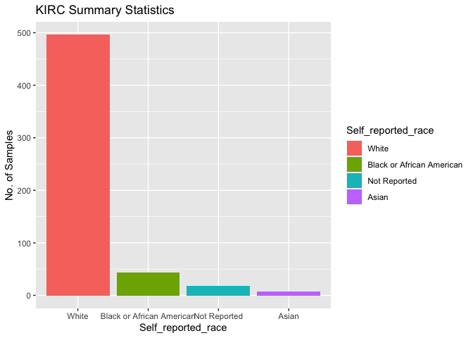<!-- -->

```r
  # labels of our plot
```

Okay, but what if we want to check the spread of Sex within each Condition?  


```r
pDat %>% 
  ggplot(aes(x = Condition, fill = Sex)) +
  geom_bar(stat = "count", width = 0.5, position = position_dodge2(preserve = "single")) +
  scale_fill_manual(values = colpal$Sex) +
  labs(title = "KIRC Summary Statistics", y = "No. of Samples") +
  theme_minimal()
```

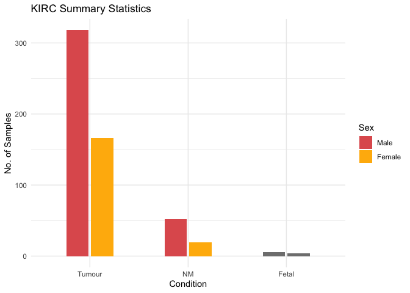<!-- -->

*To find out the explanation and all available arguments of a function, type a ? followed by the name of the function in the console (e.g., ?position_dodge2)*  

**Make any further plots that you'd like to visualize the variable distribution of**  


```r
#add normalized and non-normalized plots to compare both 


pDat %>% 
  ggplot(aes(x = Condition, fill = Self_reported_race)) +
  geom_bar(stat = "count", width = 0.5, position = position_dodge2(preserve = "single")) +
  scale_fill_manual(values = colpal$Self_reported_race) +
  labs(title = "KIRC Summary Statistics", y = "No. of Samples", legend = "Self-Reported Race") +
  theme_minimal() 
```

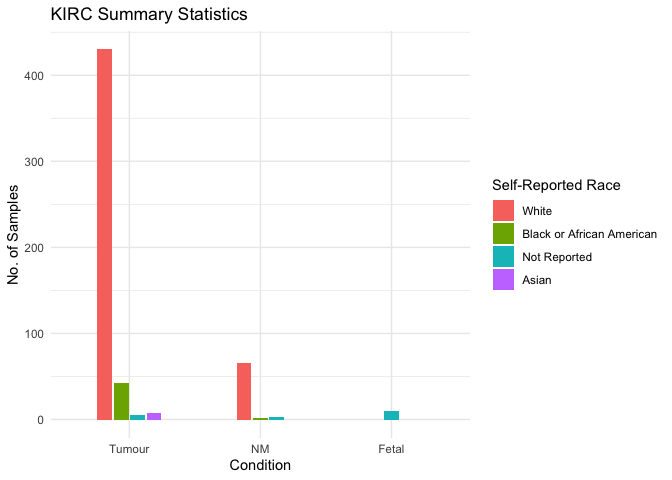<!-- -->

```r
# why does re-titling the legend erase the theme -> look up where to place the legend title ^ because fill = " " does not work 
```


**Replace the author section in the YAML at the absolute top of the script with your name**  

Once you replaced the name, navigate to the Knit option in the header --> click the drop-down arrow --> select Project Directory --> click on Knit  

**Once you have knitted the script once, play around with the theme and highlight options and select a combination that you like (all the available options for the two I've commented above)**   

# pasted part two of EDA plot below 

***  
#### 2.2 Expression data  


We'll first check how many of our raw reads aligned to either miRNAs or miRNA precursors using one of the summary files provided by miRMaster `mirbase_mapping_perc_norm.xlsx`  

**From your F Drive, upload the above files each for cluster 1, cluster 2, and fetal into the GDrive data folder, load them in and join them**  

*Hint: remember that the cluster 1 and cluster 2 files contain all samples that we ran in miRMaster, so subset to only conatin the replicates_removed samples and only the kidney fetal samples*  


```r
# try pulling from drive folder directly 
# is this the correct xlsx file? should i be using the mapping_perc_norm or the mirna quantification all?

#for mac:
# mir_stats_cluster_1 <- read_excel("/Users/Katya/Library/CloudStorage/GoogleDrive-katyahbenard@gmail.com/.shortcut-targets-by-id/1in4WV-hP-QqFT6s4z49t5DNvwTEmknZ9/KIRC/data/v0p_1syi_cluster_1_mirbase_mapping_perc_norm.xlsx")
# 
# #mir_stats_cluster_1 <- read_excel(here::here("data", "v0p_1syi_cluster_1_mirbase_mapping_perc_norm.xlsx"))
# # here::here function still not running properly - path does not exist bc current wd is in scripts_KB -> make r proj in the data folder so the file path will be correct
#   
# mir_stats_cluster_2 <- read_excel("/Users/Katya/Library/CloudStorage/GoogleDrive-katyahbenard@gmail.com/.shortcut-targets-by-id/1in4WV-hP-QqFT6s4z49t5DNvwTEmknZ9/KIRC/data/eskqc5a_cluster_2_mirbase_mapping_perc_norm.xlsx")
# 
# mir_stats_fetal <- read_excel("/Users/Katya/Library/CloudStorage/GoogleDrive-katyahbenard@gmail.com/.shortcut-targets-by-id/1in4WV-hP-QqFT6s4z49t5DNvwTEmknZ9/KIRC/data/fetal_mirbase_mapping_perc_norm.xlsx")
#  
#for desktop:
# 
# mir_stats_cluster_1 <- read_excel(here::here("data", "v0p_1syi_cluster_1_mirbase_mapping_perc_norm.xlsx"))
# mir_stats_cluster_2 <- read_excel(here::here("data", "eskqc5a_cluster_2_mirbase_mapping_perc_norm.xlsx"))
# mir_stats_fetal <- read_excel(here::here("data", "fetal_mirbase_mapping_perc_norm.xlsx"))

# for desktop when wd has been changed - temp :
mir_stats_cluster_1 <- read_excel("F:/Katya/Oncofetal_kidney/data/v0p_1syi_cluster_1_mirbase_mapping_perc_norm.xlsx")
mir_stats_cluster_2 <- read_excel("F:/Katya/Oncofetal_kidney/data/eskqc5a_cluster_2_mirbase_mapping_perc_norm.xlsx")
mir_stats_fetal <- read_excel("F:/Katya/Oncofetal_kidney/data/fetal_mirbase_mapping_perc_norm.xlsx")


# join all stats dfs together
mir_stats_all <- list(mir_stats_cluster_1, mir_stats_cluster_2, mir_stats_fetal)
  
mir_stats_all <- mir_stats_all %>% 
  reduce(full_join, by = "Mapping")

# select only samples present within pDat i.e., fetal kidney, NM, non-duplicated tumour
mir_stats <- mir_stats_all %>% 
  dplyr::select(Mapping, which(names(mir_stats_all) %in% pDat$fastq_name))
```

**Rename the mapping column to not have spaces within the words**  

*Hint: Use the `str_replace_all` function*    


```r
#rep_str = c( " " = "" )

rep_str = c( " " = "_" )

mir_stats$Mapping <- str_replace_all(mir_stats$Mapping, rep_str) 
```

**Make a new df called mDat, by joining pDat and mir_stats**  

*Hint: You'll need to first  transpose `mir_stats`, i.e., convert rows to columns and columns to rows in order to join. Use the `t` function to do so (e.g., transposed_df <- t(original_df))* 

As mentioned in the introduction, all of the sample information that is not technically clinical or phenotypic, goes into an extension of pDat, called mDat.  


```r
#mir_stats_t <- mir_stats %>% 
  
mir_stats_t <- t(mir_stats)

mir_stats_t <- as.data.frame(mir_stats_t)

mir_stats_t <- mir_stats_t %>% 
  rownames_to_column("Mapping")

mir_stats_t <- mir_stats_t %>%  
  row_to_names(row_number = 1)

colnames(mir_stats_t) [1] <-("Mapping")

#mir_stats_t[order(match(mir_stats_t$Mapping, pDat$fastq_name)), ]

mDat <- mir_stats_t %>% 
  merge(x= pDat, y = mir_stats_t, by.x = "fastq_name", by.y = "Mapping")


# mir_stats_t[order(match(mir_stats_t$Mapping, pDat$fastq_name)), ]
# > mDat <- mir_stats_t %>% 
# +   merge(pDat, mir_stats_t)
# Error in fix.by(by.x, x) : 
#   'by' must specify one or more columns as numbers, names or logical

# #mDat <- merge(pDat, mir_stats_t)
  
  #full_join(mir_stats_t, pDat,by = "fastq_name")
```

We'll now check the % of sequences aligned to either miRNAs or precursors, and also the % of sequences not aligned, for fetal samples by making a bar plot  


```r
# colnames(mDat) [19] <-("Total_Mapped_on_Precursor_or_miRNA")
# colnames(mDat) [21] <-("Total_Unmapped") 

# mDat <- mDat %>% 
#   rename("Total_Mapped_on_Precursor_or_miRNA" = "TotalMappedonPrecursorormiRNA")

# test <- mDat
# colnames(test)[11] <- "Ice cream"
# 
# test$`Ice cream`

mDat %>% 
  filter(Condition == "Fetal") %>%
  dplyr::select(Sample, Condition, Total_Mapped_on_Precursor_or_miRNA, Total_Unmapped) %>% 
  pivot_longer(cols = c(Total_Mapped_on_Precursor_or_miRNA, Total_Unmapped), 
               names_to = "Mapped", values_to = "Percentage") %>% 
  mutate(Mapped = fct_relevel(Mapped, c("Total_Unmapped", "Total_Mapped_on_Precursor_or_miRNA")),
         Percentage = as.numeric(Percentage),
         Percentage = round(Percentage, digits = 1)) %>% 
  ggplot(aes(x = Sample, y = Percentage, fill = Mapped)) +
  geom_bar(stat = "identity", width = 0.8) +
  scale_fill_manual(values = c("#969695", "#67c392")) +
  facet_grid(~"Condition", scales = "free_x") +
  theme_minimal() +
  # theme(axis.text.x = element_text(angle = 35, hjust = 1)) +
  theme(legend.position = "bottom") +
  coord_cartesian(y = c(0, 100)) +
  scale_y_continuous(breaks=seq(0, 100, 10), expand =c(0,0)) +
  labs(title = "Mapped vs. Unmapped Reads: Fetal Kidney Samples", x = "Sample", y = "Percentage", colour = "Percentage") 
```

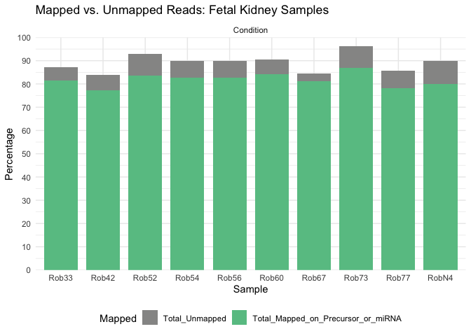<!-- -->

**Make the above plots for Tumour and NM samples. Are there any samples you think we should remove based on these metrics? If yes, why?**  

Add the `coord_flip` argument at the bottom on the plot code for the below plots  


```r
#Tumor

mDat %>% 
  filter(Condition == "Tumour") %>%
  dplyr::select(Sample, Condition, Total_Mapped_on_Precursor_or_miRNA, Total_Unmapped) %>% 
  pivot_longer(cols = c(Total_Mapped_on_Precursor_or_miRNA, Total_Unmapped), 
               names_to = "Mapped", values_to = "Percentage") %>% 
  mutate(Mapped = fct_relevel(Mapped, c("Total_Unmapped", "Total_Mapped_on_Precursor_or_miRNA")),
         Percentage = as.numeric(Percentage),
         Percentage = round(Percentage, digits = 1)) %>% 
  ggplot(aes(x = Sample, y = Percentage, fill = Mapped)) +
  geom_bar(stat = "identity", width = 0.8) +
  scale_fill_manual(values = c("#969695", "#67c392")) +
  facet_grid(~"Condition", scales = "free_x") +
  theme_minimal() +
  # theme(axis.text.x = element_text(angle = 35, hjust = 1)) +
  theme(legend.position = "bottom") +
  coord_cartesian(y = c(0, 100)) +
  scale_y_continuous(breaks=seq(0, 100, 10), expand =c(0,0)) +
  labs(title = "Mapped vs. Unmapped Reads: Tumour Kidney Samples", x = "Sample", y = "Percentage", colour = "Percentage") + 
  coord_flip()
```

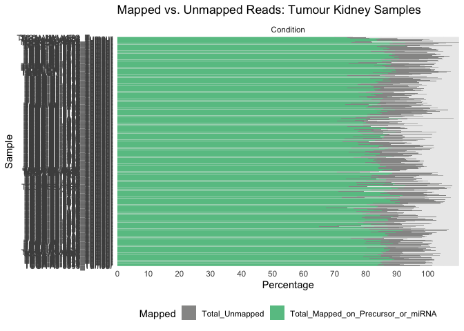<!-- -->

```r
#NM

mDat %>% 
  filter(Condition == "NM") %>%
  dplyr::select(Sample, Condition, Total_Mapped_on_Precursor_or_miRNA, Total_Unmapped) %>% 
  pivot_longer(cols = c(Total_Mapped_on_Precursor_or_miRNA, Total_Unmapped), 
               names_to = "Mapped", values_to = "Percentage") %>% 
  mutate(Mapped = fct_relevel(Mapped, c("Total_Unmapped", "Total_Mapped_on_Precursor_or_miRNA")),
         Percentage = as.numeric(Percentage),
         Percentage = round(Percentage, digits = 1)) %>% 
  ggplot(aes(x = Sample, y = Percentage, fill = Mapped)) +
  geom_bar(stat = "identity", width = 0.8) +
  scale_fill_manual(values = c("#969695", "#67c392")) +
  facet_grid(~"Condition", scales = "free_x") +
  theme_minimal() +
  # theme(axis.text.x = element_text(angle = 35, hjust = 1)) +
  theme(legend.position = "bottom") +
  coord_cartesian(y = c(0, 100)) +
  scale_y_continuous(breaks=seq(0, 100, 10), expand =c(0,0)) +
  labs(title = "Mapped vs. Unmapped Reads: NM Kidney Samples", x = "Sample", y = "Percentage", colour = "Percentage") +
  coord_flip()
```

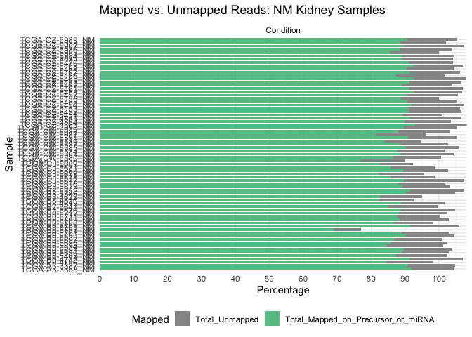<!-- -->


Let's now see the spread of our read counts (expression counts) per sample  

`ggplot2` only uses one dataframe for it's input - given that we have our expression in eDat and phenotype in pDat, we'll have to combine these dataframes in order for us to visualise our expression by variables  

We'll use the slightly advanced function `pivot_longer` to convert our wide eDat df, into a 'longer' df (when this function is used, R forgets to incorporate the rownames into the new df that we make, and so, if you have rownames, you'll have to convert them into a separate column). 


```r
eDat_long <- eDat %>% 
  pivot_longer(cols = -c(precursor, miRNA), names_to = "Sample", values_to = "Reads")
```

You'll see that all of the column names (`names_to`) have been gathered up into one column named Sample (to match the name of the column with all the names of the samples in pDat), and all the expression counts (`values_to`) have been formatted into one column I've named as Reads  

To add all the phenotype and expression data together in one df to be able to plot by different variables:  

**Join `eDat-long` with `pDat`**  


```r
eDat_long <- eDat_long %>% 
  left_join(pDat, by = "Sample")
```

We'll make a density plot and box plot to check our spread.  

When plotting expression data, it's standard practice to convert the expression counts to log2 values, as it helps visualise the differences that might exist between variables  

**Make a new variable called 'log2Reads' which is the log2 transformation of the Reads column in eDat_long**  


```r
eDat_long <- eDat_long %>% 
  mutate(log2Reads = log2(Reads))
  
# log2Reads <- eDat_long
# log2Reads[, 4] <- log(eDat_long[4], 2)
```

**Make a boxplot with Condition on the x-axis and log2Reads on the y-axis, and colour by Condition**  


```r
# install.packages("hrbrthemes")
# library(hrbrthemes)

#remember to change the reads col name to log2reads in edat long 
# eDat_long %>% 
#   ggplot( aes(x=Condition, y=Reads, fill=Condition)) +
#     geom_boxplot() +
#     scale_fill_viridis(discrete = TRUE, alpha=0.6) +
#     geom_jitter(color="black", size=0.4, alpha=0.9) +
#     theme_minimal() +
#     theme(
#       legend.position="none",
#       plot.title = element_text(size=11)
#     ) +
#     ggtitle("A boxplot with jitter") +
#     xlab("")
# 
# eDat_long %>% 
#   ggplot( aes(x=Condition, y=Reads, fill=Condition)) +
#     geom_boxplot() +
#     scale_fill_viridis(discrete = TRUE, alpha=0.6) +
#     theme_minimal() +
#     theme(
#       legend.position="none",
#       plot.title = element_text(size=11)
#     ) +
#     ggtitle("A boxplot") +
#     xlab("")

#simplified -> still need to color by condition 
# eDat_long %>% 
#   ggplot( aes(x=Condition, y=Reads, fill=Condition)) +
#     geom_boxplot() +
#     theme_minimal() 
#    
# boxplot <- ggplot(eDat_long, aes(x = Condition, y = Reads))
#   boxplot +
#     geom_boxplot()
  
# eDat_long %>% 
#   ggplot(aes(x = Condition, y = log2Reads, fill = Condition, colour = Condition)) +
#   geom_boxplot() +
#   scale_fill_manual(values = colpal$Condition) +
#   scale_colour_manual(values = colpal$Condition) +
#   theme_minimal() 

eDat_long %>% 
  ggplot(aes(x = Condition, y = log2Reads, fill = Condition, colour = Condition)) +
  geom_boxplot() +
  scale_fill_manual(values = colpal$Condition) +
  scale_colour_manual(values = colpal$Condition) +
  theme_minimal() 
```

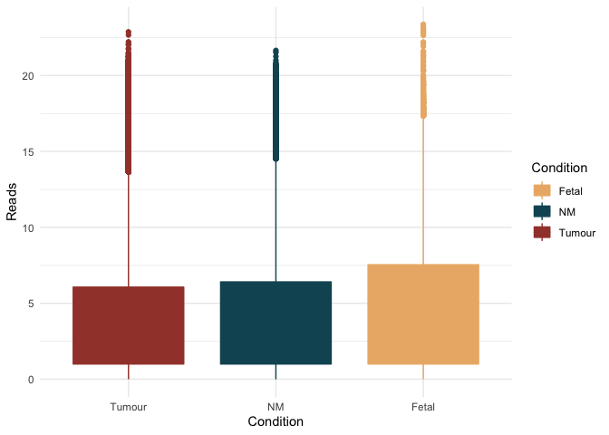<!-- -->

```r
#ggtitle("A boxplot with jitter") +
   # xlab("")

# eDat_long %>% 
#   ggplot(data = eDat_long, aes_string(x = "Condition", y = "Reads")) + 
#   geom_boxplot()
# 
# ggplot(eDat_long, aes(x=Condition, y=log2Reads)) + 
#   geom_boxplot()
#   
#    ggplot()
```

Now, you should have gotten a warning saying `Warning: [38;5;248mRemoved 1107966 rows containing non-finite values (stat_boxplot())` **Can you guess why?**  

Go ahead and convert 0 to its log2 expression:


```r
log2(0)
```

```
## [1] -Inf
```

```r
#[1] -Inf
```

We see that the log2 value of 0 is infinity, and we cannot plot an infinite value.

And so, to be able to plot 0 values, we do a log2(x + 1) transformation, the most common way to be able to visualise this expression This transformation adds a pseudo count/value of 1 to all values, essentially shifting our entire expression matrix by +1.  

Overwriting `log2Reads` to log (x + 1)


```r
eDat_long <- eDat_long %>% 
  mutate(log2Reads = log2(Reads + 1))
```

**Now, make the box plot again using our updated log2Reads**  


```r
eDat_long %>% 
  ggplot( aes(x=Condition, y=log2Reads, fill=Condition, colour = Condition)) +
    geom_boxplot() +
    scale_fill_manual(values = colpal$Condition) +
    scale_colour_manual(values = colpal$Condition) +
    theme_minimal() 
```

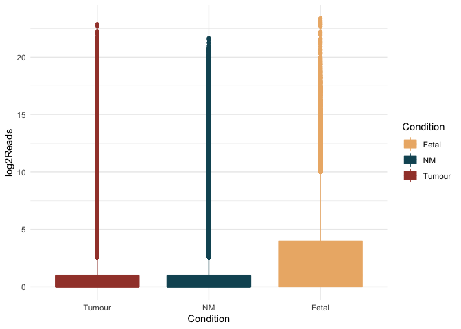<!-- -->

**Can you make a box plot which includes only the fetal samples on the x-axis?**  
*Hint: Use the `filter` function to pull out only the Fetal samples from eDat_long before piping into ggplot, and then change the x-axis variable*  


```r
# eDat_long %>% 
#    filter(Condition == "Fetal") %>%
#   ggplot(aes(x = Condition, y = log2Reads, fill = Condition, colour = Condition)) +
#   geom_boxplot() +
#   scale_fill_manual(values = colpal$Condition) +
#   scale_colour_manual(values = colpal$Condition) +
#   theme_minimal() 
  
eDat_long %>%
   filter(Condition == "Fetal") %>%
  ggplot(aes(x = Sample, y = log2Reads, fill = Condition)) +
  geom_boxplot() +
  scale_fill_manual(values = colpal$Condition) +
  #scale_colour_manual(values = colpal$Condition)  +
  theme_minimal()
```

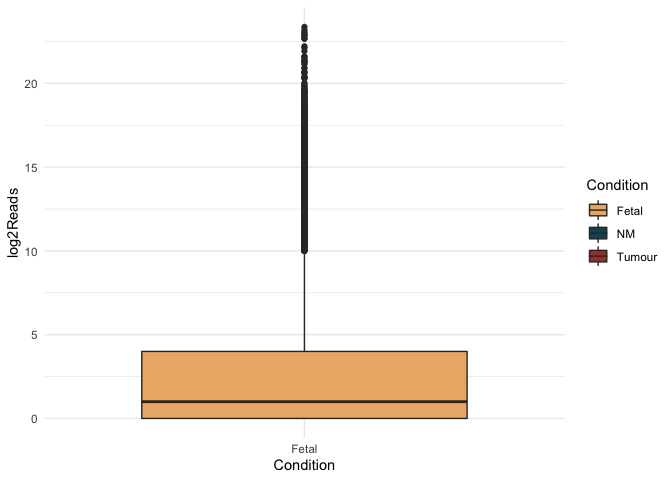<!-- -->


We'll also make a density plot, which is just a different way to view the same data:  


```r
eDat_long %>% 
  ggplot(aes(x = log2Reads, fill = Condition, colour = Condition)) +
  geom_density(alpha = 0.6) +
  scale_fill_manual(values = colpal$Condition) +
  scale_colour_manual(values = colpal$Condition) +
  labs(title = "KIRC: Raw Expression Data", y = "log2(Reads + 1)") +
  theme_minimal() 
```

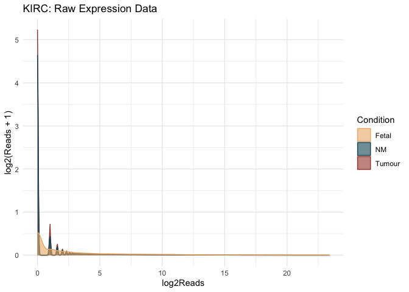<!-- -->

This is the spread of our raw data  

**Q. What do you think is the interpretation of this plot?**    

A:  majority of our expression counts are zero


**Facet the above plot by Sex, add the following argument at the end --> theme(legend.position = "bottom")**  


```r
#eDat_long %>% 
  
eDat_long %>% 
  ggplot(aes(x = log2Reads, fill = Sex, colour = Sex)) +
  geom_density(alpha = 0.6) +
  scale_fill_manual(values = colpal$Sex) +
  scale_colour_manual(values = colpal$Sex) +
  labs(title = "KIRC: Raw Expression Data", y = "log2(Reads + 1)") +
  theme_minimal() +
  theme(legend.position = "bottom")
```

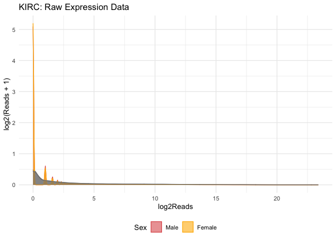<!-- -->

```r
eDat_long %>% 
  ggplot(aes(x = log2Reads, fill = Condition, colour = Condition)) +
  geom_density(alpha = 0.6) +
  scale_fill_manual(values = colpal$Condition) +
  scale_colour_manual(values = colpal$Condition) +
  facet_wrap(~Condition) +
  labs(title = "KIRC: Raw Expression Data", y = "log2(Reads + 1)") +
  theme_minimal() +
  theme(legend.position = "bottom")
```

<!-- -->

```r
eDat_long %>% 
  ggplot(aes(x = log2Reads, fill = Condition, colour = Condition)) +
  geom_density(alpha = 0.6) +
  scale_fill_manual(values = colpal$Condition) +
  scale_colour_manual(values = colpal$Condition) +
  facet_wrap(~Sex) +
  labs(title = "KIRC: Raw Expression Data", y = "log2(Reads + 1)") +
  theme_minimal() +
  theme(legend.position = "bottom")
```

<!-- -->

```r
eDat_long %>% 
  ggplot(aes(x = log2Reads, fill = Condition, colour = Condition)) +
  geom_density(alpha = 0.6) +
  scale_fill_manual(values = colpal$Condition) +
  scale_colour_manual(values = colpal$Condition) +
  facet_grid(rows = vars(Condition), cols = vars(Sex), scale = "free_x") +
  labs(title = "KIRC: Raw Expression Data", y = "log2(Reads + 1)") +
  theme_minimal() +
  theme(legend.position = "bottom")
```

<!-- -->


***  

**Write down a brief overview of renal cancer**  

- What is the incidence?  
  - life time risk in men: 1 in 46 (2.02%)
  - life time risk in women: 1 in 80 (1.03%)
  - accounts for about 2% of global cancer diagnoses and deaths, projected to increase worldwide
  
- Does incidence vary by any biological or environmental variables?  
  - incidence increases with age
  - risk factors: smoking, hypertension, obesity, acquired cystic kidney disease, long-term dialysis, family history, high blood             pressure
  - higher incidence rates in Europe and North America, low in Asia and South America 
  - known connection between air, soil, and water pollution & increased risks, but the exact mechanisms remain unknown
  
- Are there any known genes/proteins/miRNAs/pathways associated with renal cancer?  
  - prognostic markers: VHL, vascular endothelial growth factor (VEGF), carbonic anhydrase IX (CAIX)
  - 4 major RCC syndromes with autosomal dominant inheritance: Von Hippel-Lindau Disease (VHL), Hereditary Leiomyomatosis and Renal    Cell Cancer (HLRCC), Hereditary Papillary renal Carcinoma (HPRC), Birt-Hogg-Dube Syndrome (BHD)
  
  - FLCN gene (BHD), FH genes (linked to hereditary leiomyomas), SDHB and SDHD genes (familial renal cancer)
  - protein IMP3 linked with worse survival, increased risk of metastasis 
  - proteins: TPI - 1, Hsp27
  
- What is the current method of treatment?  
  - surgery, targeted therapy, immunotherapy, or a combination of these
  - occasionally radiation therapy and chemotherapy
  - highest chance for successful treatment : surgery to remove affected kidney prior to metastases 
  - frontline of standard care : immune checkpoint inhibitor-based combination therapy 
    - these drugs block checkpoint proteins from binding with their partner proteins 
    - prevention of the "off-signal" from being sent - T cells can kill the cancer cells
      - ex. CTLA-4 

- Is there a current gap in knowledge within the field?  
  - "3 primary gaps in research regarding composite models:
    - general paucity of data evaluating composite models predicting malignancy
    - lack of validation of these composite models
    - limited use of laboratory biomarkers" 


End of script  

***  

