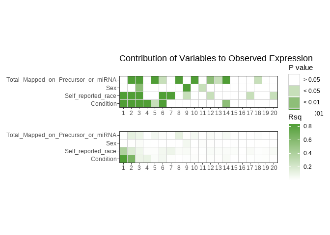

***

### 0.0 Introduction  

After going through my own LIHC analysis, I realized that the filtering method of `expression >= 1 in all 10 fetal smaples` that we've used is too stringent. We're going to redo the filtering and normalization for both clusters, and then proceed with differential analysis. 

### 1.0 Loading Packages and Data  

Loading all of our packages:  


```r
# rmarkdown packages
library(knitr) 
library(rmarkdown)

# data wrangling packages
library(tidyverse)
library(janitor)

# data loading packages
library(readxl) 
library(openxlsx)
library(here)


# setting global script options - i.e, parameters/arguents that will be applied to all chunks, without having to explicity specify them each time
knitr::opts_chunk$set(warning = FALSE, message = FALSE, error = FALSE)
```

Reading in data:  


```r
pDat <- read_excel(here::here("data", "KIRC_pDat_replicates_removed.xlsx"))
eDat <- read_rds(here::here("data", "KIRC_eDat_replicates_removed.RDS"))
mDat <- read_rds(here::here("data", "KIRC_mDat.RDS"))
 
# write_rds(mDat, "KIRC_mDat.RDS")
```

**Add your choice of font available at [Google Fonts](https://fonts.google.com/), and make your own customized ggplot2 theme**. We will now use this theme option for all future plots  


```r
library(showtext)
library(extrafont)
knitr::opts_chunk$set(fig.showtext = TRUE, fig_retina = 1) # needed to render show_text


font_add_google("Open Sans", "Sans")
# 
# colpal <- list(Condition = c(`Fetal` = "#ECB576", `NM` = "#115363", `Tumour` = "#A34237"),
#                Sex = c(`Male` = "#E05D5D", `Female` = "#ffb708"),
#                Self_reported_race = c(`Black or African American` = "#9BBC49", 
#                                       `Asian` = "#5B8D33", 
#                                       `White` = "#286E16", 
#                                       `Not Reported` = "#666666"))

colpal <- list(Condition = c(`Fetal` = "#4D6DA0", `NM` = "#72B592", `Tumour` = "#C5E3AA"),
               Sex = c(`Male` = "#9dba8f", `Female` = "#edcba0"),
               Self_Reported_Race = c(`African American or Black` = "#698ECF", `American Indian or Alaska Native` = "#565199", `Asian` = "#E26E51", `Caucasian or White` = "#F6D076", `Not Reported/Unknown` = "#de425b"), 
               Self_reported_race = c(`Black or African American` = "#698ECF", `American Indian or Alaska Native` = "#565199", `Asian` = "#E26E51", `White` = "#F6D076", `Not Reported` = "#de425b"), category= c('50-55' = "#003f5c", '55-60' = "#2f4b7c", '60-65'="#665191", '65-70'="#a05195", '70-75'="#d45087", '75-80'="#f95d6a", '80-85'="#ff7c43", '85-90'="#ffa600", '90-95'="#F6D076", '95-100'="#C5E3AA"))


my_theme <- theme_minimal() +
  theme(plot.title = element_text(family = "Sans", size = 14),
        plot.subtitle = element_text(family = "Sans", size = 12),
        legend.text = element_text(family = "Sans", size = 10),
        axis.title = element_text(family = "Sans", size = 14),
        axis.text = element_text(family = "Sans", size = 12))


# needed to bind ggplot and our custom font
showtext_auto()
```

***

### 2.0 Formatting  

**Make `eDat_long` as in the previous script, which contains the log2(x+1) expression data and phenotypic data all in one dataframe**  


```r
eDat_long <- eDat %>% 
  pivot_longer(cols = -c(precursor, miRNA), names_to = "Sample", values_to = "Reads") %>% 
  left_join(pDat, by = "Sample") %>% 
  mutate(log2Reads = log2(Reads + 1))
```

***

### 3.0 Redoing filtering and normalization

#### 3.1 Filtering

**Based on the previous `4_QC` script, starting with our raw data, I want you to filter out miRNAs which have expression = 0 in all samples**  


```r
eDat <- eDat %>% 
  unite("mirs", c(precursor, miRNA), sep = ":") %>% 
  column_to_rownames("mirs")

eFil_0 <- eDat %>% 
   filter(if_any(everything(), ~ .x > 0))

dim(eFil_0)
```

```
## [1] 2739  565
```

```r
# [1] 2739  565
```

> **CHECKPOINT:** Your `eFil_0` df should have 2739 rows and 565 columns  

**Remove mature miRNAs with duplicate expression**  


```r
eFil_0<- eFil_0 %>% 
  rownames_to_column("miRNA")

eFil_0 <- eFil_0 %>% 
  dplyr::rename ("mirs" = "miRNA")

eFil_0 %>% 
  separate(mirs, c("precursor", "miRNA"), sep = ":") %>%
  dplyr::count(miRNA) %>% # count the frequency of mature miRNAs
  filter(n > 1) # filter to keep only the ones which have a count of more than 1
```

```
##                 miRNA  n
## 1       hsa-let-7a-3p  2
## 2       hsa-let-7a-5p  3
## 3       hsa-let-7f-5p  2
## 4        hsa-miR-1-3p  2
## 5      hsa-miR-101-3p  2
## 6     hsa-miR-103a-3p  2
## 7        hsa-miR-103b  2
## 8    hsa-miR-10401-3p  4
## 9    hsa-miR-10401-5p  4
## 10     hsa-miR-105-3p  2
## 11     hsa-miR-105-5p  2
## 12    hsa-miR-1185-5p  2
## 13    hsa-miR-1233-3p  2
## 14    hsa-miR-1233-5p  2
## 15     hsa-miR-124-3p  3
## 16     hsa-miR-124-5p  3
## 17       hsa-miR-1244  4
## 18   hsa-miR-1255b-5p  2
## 19    hsa-miR-125b-5p  2
## 20     hsa-miR-128-3p  2
## 21       hsa-miR-1283  2
## 22    hsa-miR-1285-3p  2
## 23       hsa-miR-1289  2
## 24     hsa-miR-129-5p  2
## 25       hsa-miR-1302 11
## 26    hsa-miR-133a-3p  2
## 27    hsa-miR-133a-5p  2
## 28    hsa-miR-135a-5p  2
## 29     hsa-miR-138-5p  2
## 30     hsa-miR-153-3p  2
## 31      hsa-miR-16-5p  2
## 32    hsa-miR-181a-5p  2
## 33    hsa-miR-181b-5p  2
## 34     hsa-miR-194-5p  2
## 35    hsa-miR-196a-5p  2
## 36       hsa-miR-1972  2
## 37    hsa-miR-199a-3p  2
## 38    hsa-miR-199a-5p  2
## 39     hsa-miR-19b-3p  2
## 40     hsa-miR-218-5p  2
## 41    hsa-miR-219a-5p  2
## 42      hsa-miR-24-3p  2
## 43     hsa-miR-26a-5p  2
## 44     hsa-miR-29b-3p  2
## 45     hsa-miR-30c-5p  2
## 46       hsa-miR-3116  2
## 47       hsa-miR-3118  4
## 48       hsa-miR-3119  2
## 49    hsa-miR-3130-3p  2
## 50    hsa-miR-3130-5p  2
## 51    hsa-miR-3156-3p  2
## 52    hsa-miR-3156-5p  3
## 53    hsa-miR-3158-3p  2
## 54    hsa-miR-3158-5p  2
## 55    hsa-miR-3160-3p  2
## 56    hsa-miR-3160-5p  2
## 57       hsa-miR-3179  4
## 58       hsa-miR-3180  2
## 59    hsa-miR-3180-3p  3
## 60    hsa-miR-3180-5p  3
## 61       hsa-miR-3198  2
## 62       hsa-miR-3199  2
## 63       hsa-miR-3202  2
## 64       hsa-miR-320b  2
## 65       hsa-miR-320c  2
## 66       hsa-miR-320d  2
## 67     hsa-miR-329-3p  2
## 68     hsa-miR-329-5p  2
## 69       hsa-miR-3648  2
## 70       hsa-miR-3670  4
## 71    hsa-miR-3680-3p  2
## 72    hsa-miR-3680-5p  2
## 73    hsa-miR-3688-3p  2
## 74    hsa-miR-3688-5p  2
## 75       hsa-miR-3690  2
## 76    hsa-miR-376a-3p  2
## 77       hsa-miR-378d  2
## 78       hsa-miR-3910  2
## 79    hsa-miR-3913-3p  2
## 80    hsa-miR-3913-5p  2
## 81       hsa-miR-3914  2
## 82       hsa-miR-3926  2
## 83       hsa-miR-4315  2
## 84       hsa-miR-4435  2
## 85   hsa-miR-4436b-3p  2
## 86   hsa-miR-4436b-5p  2
## 87       hsa-miR-4444  2
## 88       hsa-miR-4472  2
## 89      hsa-miR-4477a  2
## 90      hsa-miR-4477b  2
## 91    hsa-miR-450a-5p  2
## 92    hsa-miR-4520-5p  2
## 93    hsa-miR-4536-3p  2
## 94    hsa-miR-4536-5p  2
## 95    hsa-miR-4650-3p  2
## 96    hsa-miR-4650-5p  2
## 97       hsa-miR-4679  2
## 98       hsa-miR-4773  2
## 99    hsa-miR-4776-5p  2
## 100    hsa-miR-486-3p  2
## 101    hsa-miR-486-5p  2
## 102    hsa-miR-509-3p  3
## 103    hsa-miR-509-5p  2
## 104    hsa-miR-512-3p  2
## 105    hsa-miR-512-5p  2
## 106   hsa-miR-513a-3p  2
## 107   hsa-miR-513a-5p  2
## 108   hsa-miR-514a-3p  3
## 109   hsa-miR-514a-5p  3
## 110    hsa-miR-515-3p  2
## 111    hsa-miR-515-5p  2
## 112   hsa-miR-516a-5p  2
## 113   hsa-miR-516b-5p  2
## 114    hsa-miR-517-5p  3
## 115   hsa-miR-518a-3p  2
## 116   hsa-miR-518a-5p  2
## 117   hsa-miR-519a-3p  2
## 118       hsa-miR-521  2
## 119   hsa-miR-526a-5p  2
## 120   hsa-miR-548a-3p  3
## 121     hsa-miR-548aa  2
## 122  hsa-miR-548ae-3p  2
## 123     hsa-miR-548ag  2
## 124  hsa-miR-548aj-3p  2
## 125   hsa-miR-548d-3p  2
## 126   hsa-miR-548d-5p  2
## 127   hsa-miR-548f-3p  5
## 128   hsa-miR-548h-5p  5
## 129      hsa-miR-548i  4
## 130   hsa-miR-548o-3p  2
## 131   hsa-miR-548x-3p  2
## 132   hsa-miR-550a-3p  3
## 133   hsa-miR-550a-5p  2
## 134 hsa-miR-550b-2-5p  2
## 135   hsa-miR-550b-3p  2
## 136   hsa-miR-5583-3p  2
## 137   hsa-miR-5583-5p  2
## 138     hsa-miR-5692a  2
## 139     hsa-miR-5692c  2
## 140      hsa-miR-5701  3
## 141      hsa-miR-6089  2
## 142  hsa-miR-6511a-3p  4
## 143  hsa-miR-6511a-5p  4
## 144  hsa-miR-6511b-3p  2
## 145  hsa-miR-6511b-5p  2
## 146   hsa-miR-6724-5p  4
## 147   hsa-miR-6770-3p  3
## 148   hsa-miR-6770-5p  3
## 149   hsa-miR-6859-3p  4
## 150   hsa-miR-6859-5p  4
## 151   hsa-miR-6862-3p  2
## 152   hsa-miR-6862-5p  2
## 153      hsa-miR-7-5p  3
## 154      hsa-miR-8069  2
## 155      hsa-miR-8071  2
## 156      hsa-miR-9-3p  3
## 157      hsa-miR-9-5p  3
## 158    hsa-miR-92a-3p  2
## 159       hsa-miR-941  5
## 160      hsa-miR-9902  2
```

```r
eFil <- eFil_0 %>% 
  separate(mirs, c("precursor", "miRNA"), sep = ":") %>% 
  mutate(Sum = rowSums(select_if(., is.numeric))) %>% 
  group_by(miRNA) %>% 
  slice_max(Sum) %>% 
  dplyr::select(-Sum, -precursor) %>%
  distinct(miRNA, .keep_all = TRUE) %>%
  column_to_rownames("miRNA")

eDat <- eDat %>% 
  rownames_to_column("miRNA")
# split miRNA column in eDat to mirna and precursor 
# re-left join eFil and eDat
 eDat <- eDat %>% 
   separate(miRNA, c("precursor", "miRNA"), sep = ":")

dim(eFil)
```

```
## [1] 2519  565
```

```r
#220 duplicated expected
#2519 565 produced 
```

> **CHECKPOINT:** Your `eFil` df should have 2519 rows and 565 columns  


**Make separate eFils and pDats per KIRC cluster and by fetal, and join the fetal samples to both cluster 1 and cluster 2**


```r
#make matrix for eFil long
eFil<- eFil %>% 
  rownames_to_column("miRNA")

library(dplyr)

filtered_mature_df = data.frame(matrix(nrow = 2519, ncol = 1))
filtered_mature_df$matrix.nrow...2519..ncol...1.<- eFil$miRNA
colnames(filtered_mature_df) <- c("target")
require(dplyr)
data <- semi_join(eDat,filtered_mature_df, by = c(miRNA = "target"))
row.names(data) <- data$gene


data2 <- data %>% 
  mutate(Sum = rowSums(select_if(., is.numeric))) %>% 
  group_by(miRNA) %>% 
  slice_max(Sum) %>% 
  dplyr::select(-Sum, -precursor) %>%
  distinct(miRNA, .keep_all = TRUE) %>%
  column_to_rownames("miRNA")

dim(data2)
```

```
## [1] 2519  565
```

```r
#2519 565

#make eFil_long

data2<- data2 %>% 
  rownames_to_column("miRNA")

eFil_long <- data2 %>% 
  pivot_longer(cols = -c(miRNA), names_to = "Sample", values_to = "Reads")

eFil_long_2 <- eFil_long %>% 
  left_join(pDat, by = "Sample")

eFil_long_2 <- eFil_long_2 %>% 
  mutate(log2Reads = log2(Reads + 1))

#------------------------------------------------------------------

pDat %>% 
  dplyr::count(cluster_group)
```

```
## # A tibble: 3 × 2
##   cluster_group     n
##           <dbl> <int>
## 1             1   279
## 2             2   276
## 3            NA    10
```

```r
# fetal filtered
pDat_fetal <- pDat %>% 
    filter(Condition == "Fetal")
  
eFil_fetal <-eFil_long_2 %>%
  filter(Condition == "Fetal")

# cluster 1 filtered

pDat_cluster_1 <- pDat %>%
  filter(cluster_group == 1)

eFil_cluster_1 <- eFil_long_2 %>%
  filter(cluster_group == 1)

# cluster 2 filtered

pDat_cluster_2 <- pDat %>%
  filter(cluster_group ==2)

eFil_cluster_2 <- eFil_long_2 %>%
  filter(cluster_group == 2)

# joining fetal and c1

eFil_c1_fetal <- rbind(eFil_cluster_1,eFil_fetal)

pDat_c1_fetal <- rbind(pDat_cluster_1, pDat_fetal)
#has 289 samples
  
# joining fetal and c2
eFil_c2_fetal <- rbind(eFil_cluster_2,eFil_fetal)

pDat_c2_fetal <- rbind(pDat_cluster_2, pDat_fetal)
#has 286 samples

#eDat or eFil?
```

> **CHECKPOINT: You should have 289 samples in eDat_c1_fetal, and 286 samples in eDat_c2_fetal**  


#### 3.2 Normalization

**Normalize filtered dataframe for both cluster groups**


```r
#BiocManager::install("DESeq2")
#install.packages(DESeq2)
library(DESeq2)

#BiocManager::install("edgeR")
#install.packages(edgeR)
library(edgeR)

filtered_mirna_names <- as.data.frame(row.names(eFil)) 

eDat_matrix <- data2 %>% 
  column_to_rownames("miRNA") %>% 
  as.matrix()

eNorm <- as.data.frame(row.names(eDat_matrix))

all_cols <- colnames(eDat_matrix)

c1_fetal_cols <- all_cols[colnames(eDat_matrix) %in% pDat_c1_fetal$Sample]
c2_fetal_cols <- all_cols[colnames(eDat_matrix) %in% pDat_c2_fetal$Sample]

# Create new data frames
c1_fetal_matrix <- eDat_matrix %>% 
  as.data.frame() %>% 
  dplyr::select(c1_fetal_cols)

c2_fetal_matrix <- eDat_matrix %>% 
  as.data.frame() %>% 
  dplyr::select(c2_fetal_cols)

# cluster 1
samples_cluster_1 <- pDat_c1_fetal$Sample

norm_c1 <- DGEList(counts = c1_fetal_matrix, samples = pDat_c1_fetal$Sample, genes = eNorm)

# norm_counts_c1 <- DGEList(genes = filtered_mirna_names, 
#                           counts = eFil_c1_fetal, 
#                           samples = samples_cluster_1)

norm_c1 <- calcNormFactors(norm_c1, method = "RLE")

head(norm_c1[["samples"]])
```

```
##       group lib.size norm.factors         samples
## RobN4     1 11582218     1.692696 TCGA-B8-4619_NM
## Rob33     1 18998637     1.494068 TCGA-CZ-4865_NM
## Rob42     1 30725689     2.086299 TCGA-CJ-5681_NM
## Rob52     1 23787583     1.916552 TCGA-CZ-5469_NM
## Rob54     1 17614347     1.259953 TCGA-CZ-5462_NM
## Rob56     1 20303809     1.032426 TCGA-CZ-5451_NM
```

```r
eNorm_c1 <- cpm(norm_c1)

#eNorm_c1 <- log2(eNorm_c1 + 1)

eNorm_c1 <- round(eNorm_c1, digits = 0)

eNorm_c1 <- as.data.frame(eNorm_c1)
#------------------------------------------------------------------------------
# norm_counts_c1 <- calcNormFactors(norm_counts_c1, method = "RLE")
# 
# head(norm_counts_c1[["samples"]]) 
# 
# eNorm_c1 <- cpm(norm_counts_c1)
# 
# eNorm_c1 <- log2(eNorm_c1 + 1) 
# 
# eNorm_c1 <- round(eNorm_c1, digits = 0)
# 
# eNorm_c1 <- as.data.frame(eNorm_c1)


# cluster 2
samples_cluster_2 <- pDat_c2_fetal$Sample

norm_c2 <- DGEList(counts = c2_fetal_matrix, samples = pDat_c2_fetal$Sample, genes = eNorm)

norm_c2 <- calcNormFactors(norm_c2, method = "RLE")

head(norm_c2[["samples"]]) 
```

```
##       group lib.size norm.factors         samples
## RobN4     1 11582218    1.6336802 TCGA-CJ-5689_NM
## Rob33     1 18998637    1.4408196 TCGA-CW-5591_NM
## Rob42     1 30725689    1.9204637 TCGA-A3-3358_NM
## Rob52     1 23787583    1.8017499 TCGA-CZ-4863_NM
## Rob54     1 17614347    1.1377402 TCGA-CJ-5676_NM
## Rob56     1 20303809    0.9888799 TCGA-B2-5641_NM
```

```r
eNorm_c2 <- cpm(norm_c2)

#eNorm_c2 <- log2(eNorm_c2 + 1)

eNorm_c2 <- round(eNorm_c2, digits = 0)

eNorm_c2 <- as.data.frame(eNorm_c2)
```


**Make density and boxplots for raw normalized data, and display all plots together (you should have a total of 6 plots)** 


```r
library(ggpubr)

eNorm_c1 <- eNorm_c1 %>% 
  rownames_to_column("miRNA")
  
eNorm_c1_long <- eNorm_c1 %>%
  pivot_longer(cols = -c(miRNA), names_to = "Sample", values_to = "Reads")

eNorm_c1_long <- eNorm_c1_long %>% 
  left_join(pDat_c1_fetal, by = "Sample")

eNorm_c1_long <- eNorm_c1_long %>% 
  mutate(log2Reads = log2(Reads + 1))

eNorm_c2 <- eNorm_c2 %>% 
  rownames_to_column("miRNA")

eNorm_c2_long <- eNorm_c2 %>%
  pivot_longer(cols = -c(miRNA), names_to = "Sample", values_to = "Reads")

eNorm_c2_long <- eNorm_c2_long %>% 
  left_join(pDat_c2_fetal, by = "Sample")

eNorm_c2_long <- eNorm_c2_long %>% 
  mutate(log2Reads = log2(Reads + 1))

# density
d1 <- eDat_long %>% 
  ggplot(aes(x = log2Reads, fill = Condition, colour = Condition)) +
  geom_density(alpha = 0.6) +
  scale_fill_manual(values = c("#de425b","#698ECF","#72B592")) +
  # scale_colour_manual(values = colpal$Condition) +
  labs(title = "KIRC: Raw Expression Data (eDat) ", y = "log2Reads") +
  theme_minimal() 

  
d2 <- eNorm_c1_long %>% 
  ggplot(aes(x = log2Reads, fill = Condition, colour = Condition)) +
  geom_density(alpha = 0.6) +
  scale_fill_manual(values = c("#de425b","#698ECF","#72B592")) +
  # scale_colour_manual(values = colpal$Condition) +
  labs(title = "KIRC: C1 Normalized Expression Data", y = "Density") +
  theme_minimal()


d3 <- eNorm_c2_long %>% 
  ggplot(aes(x = log2Reads, fill = Condition, colour = Condition)) +
  geom_density(alpha = 0.6) +
  scale_fill_manual(values = c("#de425b","#698ECF","#72B592")) +
  # scale_colour_manual(values = colpal$Condition) +
  labs(title = "KIRC: C2 Normalized Expression Data", y = "Density") +
  theme_minimal()

# boxplot
b1 <-eDat_long %>% 
  ggplot(aes(x = Condition, y = log2Reads, fill = Condition, colour = Condition)) +
  geom_boxplot() +
  scale_fill_manual(values = colpal$Condition) +
  scale_colour_manual(values = colpal$Condition) + 
  labs(title = "KIRC: Raw Expression Data (eDat) ", y = "log2Reads") +
  theme_minimal() 

b2 <- eNorm_c1_long %>% 
  ggplot(aes(x = Condition, y = log2Reads, fill = Condition, colour = Condition)) +
  geom_boxplot() +
  scale_fill_manual(values = colpal$Condition) +
  scale_colour_manual(values = colpal$Condition) +
  labs(title = "KIRC: C1 Normalized Expression Data", y = "log2Reads") +
  theme_minimal()

b3 <- eNorm_c2_long %>% 
  ggplot(aes(x = Condition, y = log2Reads, fill = Condition, colour = Condition)) +
  geom_boxplot() +
  scale_fill_manual(values = colpal$Condition) +
  scale_colour_manual(values = colpal$Condition) +
  labs(title = "KIRC: C2 Normalized Expression Data", y = "log2Reads") +
  theme_minimal()

ggarrange(b1, d1, b2, d2, b3, d3, nrow = 3, ncol = 2)
```

<!-- -->

Overwrite the previously saved eFil and eNorm objects 


```r
# write_rds(eFil, here::here("data", "eFil.rds"))
 # write_rds(eNorm_c1, here::here("data", "KIRC_eNorm_c1.rds"))
 # write_rds(eNorm_c2, here::here("data", "KIRC_eNorm_c2.rds"))
```


> We will only be using cluster 1 samples for all of our downstream analyses, and only using the cluster 2 samples at the end as a validation cohort.  

***

### 4.0 PCA  

Principal Component Analysis (PCA) is a type of dimensionality reduction method. Dimensionality reduction techniques allow us to observe ‘big data’ in a meaningful way, where all of the expression data per sample per gene is converted into units showing the ‘distance’ i.e., similarity between them. Here we’ll be using PCA (tSNE and UMAP are two other methods), which reduces and converts our data points into distinct Principal Components (which have no units of measure) and shows us how much variability exists between our data, and which variables are contributing towards that variation

#### 4.1 Calculating PCA


```r
# first convert eNorm to log2 + 1

eNorm_c1 <- eNorm_c1 %>% 
  column_to_rownames("miRNA")

eLog <- log2(eNorm_c1 + 1)

# the function we use performs its operation row-wise, and since we want to check the variability between genes and not the samples, we'll transpose our exp df to convert the samples to be rows, and the columns to be our genes. Don't open this df as it might cause R to crash (as there will be more columns than rows in this df now)
t_eLog <- as.data.frame(t(eLog))

# the function to compute PCA. We set scale to FALSE, because we already log10 scaled our data, and center to TRUE, so that the values are converted to Z-scores
pca_c1 <- prcomp(t_eLog, scale = FALSE, center = TRUE) #n has to be less than number of samples

# each score represents the contribution of each gene within each sample
scores_c1 <- pca_c1$x

summary(pca_c1)
```

```
## Importance of components:
##                            PC1     PC2     PC3     PC4     PC5     PC6     PC7
## Standard deviation     11.5061 7.67030 6.51281 5.25896 5.06922 4.56562 4.31264
## Proportion of Variance  0.1841 0.08181 0.05898 0.03846 0.03573 0.02899 0.02586
## Cumulative Proportion   0.1841 0.26590 0.32488 0.36334 0.39907 0.42806 0.45392
##                            PC8     PC9    PC10    PC11    PC12    PC13    PC14
## Standard deviation     4.13094 3.67610 3.57108 3.44972 3.22734 3.09896 2.96737
## Proportion of Variance 0.02373 0.01879 0.01773 0.01655 0.01448 0.01335 0.01224
## Cumulative Proportion  0.47765 0.49644 0.51417 0.53072 0.54520 0.55856 0.57080
##                           PC15    PC16    PC17    PC18    PC19    PC20    PC21
## Standard deviation     2.85237 2.78349 2.65179 2.61471 2.50032 2.39645 2.35042
## Proportion of Variance 0.01131 0.01077 0.00978 0.00951 0.00869 0.00799 0.00768
## Cumulative Proportion  0.58211 0.59289 0.60266 0.61217 0.62086 0.62885 0.63653
##                           PC22    PC23    PC24    PC25    PC26    PC27    PC28
## Standard deviation     2.34091 2.28227 2.26452 2.22604 2.12595 2.09566 2.08938
## Proportion of Variance 0.00762 0.00724 0.00713 0.00689 0.00628 0.00611 0.00607
## Cumulative Proportion  0.64415 0.65139 0.65853 0.66542 0.67170 0.67781 0.68388
##                           PC29    PC30    PC31    PC32    PC33    PC34    PC35
## Standard deviation     1.99182 1.97724 1.93898 1.93085 1.89764 1.87865 1.83592
## Proportion of Variance 0.00552 0.00544 0.00523 0.00518 0.00501 0.00491 0.00469
## Cumulative Proportion  0.68939 0.69483 0.70006 0.70524 0.71025 0.71516 0.71984
##                           PC36    PC37    PC38   PC39    PC40   PC41    PC42
## Standard deviation     1.80538 1.76881 1.74833 1.7375 1.71011 1.6957 1.67671
## Proportion of Variance 0.00453 0.00435 0.00425 0.0042 0.00407 0.0040 0.00391
## Cumulative Proportion  0.72438 0.72873 0.73298 0.7372 0.74124 0.7452 0.74915
##                          PC43    PC44    PC45    PC46   PC47    PC48    PC49
## Standard deviation     1.6540 1.62867 1.61087 1.56872 1.5404 1.53327 1.50580
## Proportion of Variance 0.0038 0.00369 0.00361 0.00342 0.0033 0.00327 0.00315
## Cumulative Proportion  0.7530 0.75664 0.76025 0.76367 0.7670 0.77024 0.77339
##                           PC50    PC51    PC52    PC53    PC54    PC55    PC56
## Standard deviation     1.49561 1.49156 1.48916 1.45197 1.43986 1.42642 1.41264
## Proportion of Variance 0.00311 0.00309 0.00308 0.00293 0.00288 0.00283 0.00277
## Cumulative Proportion  0.77650 0.77960 0.78268 0.78561 0.78850 0.79132 0.79410
##                           PC57    PC58    PC59    PC60    PC61    PC62    PC63
## Standard deviation     1.40260 1.37748 1.37393 1.35568 1.34745 1.32706 1.31209
## Proportion of Variance 0.00274 0.00264 0.00262 0.00256 0.00252 0.00245 0.00239
## Cumulative Proportion  0.79684 0.79947 0.80210 0.80465 0.80718 0.80963 0.81202
##                           PC64    PC65    PC66    PC67    PC68    PC69    PC70
## Standard deviation     1.30514 1.29423 1.28333 1.27251 1.26544 1.24714 1.24379
## Proportion of Variance 0.00237 0.00233 0.00229 0.00225 0.00223 0.00216 0.00215
## Cumulative Proportion  0.81439 0.81672 0.81901 0.82126 0.82349 0.82565 0.82780
##                          PC71    PC72    PC73    PC74    PC75    PC76    PC77
## Standard deviation     1.2298 1.22462 1.20592 1.19442 1.18984 1.18837 1.18660
## Proportion of Variance 0.0021 0.00209 0.00202 0.00198 0.00197 0.00196 0.00196
## Cumulative Proportion  0.8299 0.83199 0.83401 0.83600 0.83796 0.83993 0.84189
##                           PC78    PC79    PC80   PC81   PC82    PC83    PC84
## Standard deviation     1.16105 1.15927 1.14856 1.1375 1.1366 1.13157 1.12277
## Proportion of Variance 0.00187 0.00187 0.00183 0.0018 0.0018 0.00178 0.00175
## Cumulative Proportion  0.84376 0.84563 0.84746 0.8493 0.8511 0.85284 0.85459
##                           PC85    PC86    PC87    PC88    PC89    PC90    PC91
## Standard deviation     1.11515 1.11126 1.10211 1.09517 1.08963 1.08494 1.08196
## Proportion of Variance 0.00173 0.00172 0.00169 0.00167 0.00165 0.00164 0.00163
## Cumulative Proportion  0.85632 0.85804 0.85973 0.86140 0.86305 0.86468 0.86631
##                           PC92    PC93    PC94    PC95   PC96    PC97    PC98
## Standard deviation     1.06510 1.05368 1.05052 1.04515 1.0400 1.03008 1.02922
## Proportion of Variance 0.00158 0.00154 0.00153 0.00152 0.0015 0.00148 0.00147
## Cumulative Proportion  0.86789 0.86943 0.87097 0.87249 0.8740 0.87547 0.87694
##                           PC99   PC100   PC101   PC102   PC103   PC104   PC105
## Standard deviation     1.01805 1.01356 1.01330 1.00550 0.99598 0.99161 0.98822
## Proportion of Variance 0.00144 0.00143 0.00143 0.00141 0.00138 0.00137 0.00136
## Cumulative Proportion  0.87838 0.87981 0.88124 0.88264 0.88402 0.88539 0.88675
##                          PC106   PC107   PC108  PC109   PC110   PC111   PC112
## Standard deviation     0.98607 0.97963 0.97525 0.9673 0.96489 0.96249 0.95492
## Proportion of Variance 0.00135 0.00133 0.00132 0.0013 0.00129 0.00129 0.00127
## Cumulative Proportion  0.88810 0.88943 0.89075 0.8921 0.89335 0.89464 0.89591
##                          PC113   PC114   PC115  PC116  PC117   PC118   PC119
## Standard deviation     0.95194 0.93949 0.93910 0.9289 0.9280 0.92268 0.91895
## Proportion of Variance 0.00126 0.00123 0.00123 0.0012 0.0012 0.00118 0.00117
## Cumulative Proportion  0.89717 0.89839 0.89962 0.9008 0.9020 0.90320 0.90438
##                          PC120   PC121   PC122   PC123   PC124  PC125   PC126
## Standard deviation     0.91218 0.90605 0.90521 0.89610 0.89417 0.8889 0.87859
## Proportion of Variance 0.00116 0.00114 0.00114 0.00112 0.00111 0.0011 0.00107
## Cumulative Proportion  0.90553 0.90667 0.90781 0.90893 0.91004 0.9111 0.91221
##                          PC127   PC128   PC129   PC130   PC131   PC132   PC133
## Standard deviation     0.87792 0.87381 0.86824 0.86519 0.85939 0.85501 0.85467
## Proportion of Variance 0.00107 0.00106 0.00105 0.00104 0.00103 0.00102 0.00102
## Cumulative Proportion  0.91329 0.91435 0.91540 0.91644 0.91746 0.91848 0.91950
##                         PC134   PC135   PC136   PC137   PC138   PC139   PC140
## Standard deviation     0.8499 0.84440 0.84115 0.83707 0.83514 0.82918 0.82498
## Proportion of Variance 0.0010 0.00099 0.00098 0.00097 0.00097 0.00096 0.00095
## Cumulative Proportion  0.9205 0.92149 0.92248 0.92345 0.92442 0.92538 0.92632
##                          PC141   PC142   PC143   PC144  PC145  PC146   PC147
## Standard deviation     0.82298 0.81994 0.81184 0.80995 0.8046 0.8027 0.79851
## Proportion of Variance 0.00094 0.00093 0.00092 0.00091 0.0009 0.0009 0.00089
## Cumulative Proportion  0.92726 0.92820 0.92912 0.93003 0.9309 0.9318 0.93271
##                          PC148   PC149   PC150   PC151   PC152   PC153   PC154
## Standard deviation     0.79373 0.79077 0.78879 0.78462 0.78298 0.77701 0.77199
## Proportion of Variance 0.00088 0.00087 0.00087 0.00086 0.00085 0.00084 0.00083
## Cumulative Proportion  0.93359 0.93446 0.93532 0.93618 0.93703 0.93787 0.93870
##                          PC155   PC156   PC157  PC158   PC159   PC160   PC161
## Standard deviation     0.76899 0.76489 0.76229 0.7598 0.75594 0.75335 0.74797
## Proportion of Variance 0.00082 0.00081 0.00081 0.0008 0.00079 0.00079 0.00078
## Cumulative Proportion  0.93952 0.94033 0.94114 0.9419 0.94274 0.94353 0.94431
##                          PC162   PC163   PC164   PC165   PC166   PC167   PC168
## Standard deviation     0.74404 0.74295 0.74189 0.73493 0.72756 0.72546 0.72414
## Proportion of Variance 0.00077 0.00077 0.00077 0.00075 0.00074 0.00073 0.00073
## Cumulative Proportion  0.94508 0.94584 0.94661 0.94736 0.94810 0.94883 0.94956
##                          PC169   PC170   PC171  PC172  PC173   PC174   PC175
## Standard deviation     0.72175 0.71559 0.71309 0.7104 0.7083 0.70306 0.70075
## Proportion of Variance 0.00072 0.00071 0.00071 0.0007 0.0007 0.00069 0.00068
## Cumulative Proportion  0.95028 0.95099 0.95170 0.9524 0.9531 0.95379 0.95447
##                          PC176   PC177   PC178   PC179   PC180   PC181   PC182
## Standard deviation     0.69711 0.69285 0.68950 0.68679 0.68520 0.67978 0.67881
## Proportion of Variance 0.00068 0.00067 0.00066 0.00066 0.00065 0.00064 0.00064
## Cumulative Proportion  0.95515 0.95581 0.95647 0.95713 0.95778 0.95843 0.95907
##                          PC183   PC184   PC185   PC186   PC187   PC188   PC189
## Standard deviation     0.67519 0.67172 0.67098 0.66637 0.66352 0.66062 0.66022
## Proportion of Variance 0.00063 0.00063 0.00063 0.00062 0.00061 0.00061 0.00061
## Cumulative Proportion  0.95970 0.96033 0.96095 0.96157 0.96218 0.96279 0.96340
##                         PC190   PC191   PC192   PC193   PC194   PC195   PC196
## Standard deviation     0.6565 0.65235 0.64999 0.64534 0.64488 0.63957 0.63337
## Proportion of Variance 0.0006 0.00059 0.00059 0.00058 0.00058 0.00057 0.00056
## Cumulative Proportion  0.9640 0.96459 0.96517 0.96575 0.96633 0.96690 0.96746
##                          PC197   PC198   PC199   PC200   PC201   PC202   PC203
## Standard deviation     0.63243 0.63050 0.62781 0.62354 0.61952 0.61859 0.61462
## Proportion of Variance 0.00056 0.00055 0.00055 0.00054 0.00053 0.00053 0.00053
## Cumulative Proportion  0.96801 0.96857 0.96912 0.96966 0.97019 0.97072 0.97125
##                          PC204   PC205   PC206   PC207  PC208   PC209   PC210
## Standard deviation     0.61120 0.60985 0.60653 0.60309 0.6000 0.59650 0.59415
## Proportion of Variance 0.00052 0.00052 0.00051 0.00051 0.0005 0.00049 0.00049
## Cumulative Proportion  0.97177 0.97228 0.97280 0.97330 0.9738 0.97430 0.97479
##                          PC211   PC212   PC213   PC214   PC215   PC216   PC217
## Standard deviation     0.59127 0.58879 0.58744 0.58580 0.58178 0.57710 0.57590
## Proportion of Variance 0.00049 0.00048 0.00048 0.00048 0.00047 0.00046 0.00046
## Cumulative Proportion  0.97527 0.97576 0.97624 0.97671 0.97718 0.97765 0.97811
##                          PC218   PC219   PC220   PC221   PC222   PC223   PC224
## Standard deviation     0.57360 0.56965 0.56588 0.56271 0.56187 0.55980 0.55558
## Proportion of Variance 0.00046 0.00045 0.00045 0.00044 0.00044 0.00044 0.00043
## Cumulative Proportion  0.97857 0.97902 0.97946 0.97990 0.98034 0.98078 0.98121
##                          PC225   PC226   PC227   PC228  PC229  PC230  PC231
## Standard deviation     0.55290 0.54953 0.54697 0.54323 0.5363 0.5353 0.5337
## Proportion of Variance 0.00043 0.00042 0.00042 0.00041 0.0004 0.0004 0.0004
## Cumulative Proportion  0.98163 0.98205 0.98247 0.98288 0.9833 0.9837 0.9841
##                          PC232   PC233   PC234   PC235   PC236   PC237   PC238
## Standard deviation     0.52779 0.52649 0.52422 0.51886 0.51794 0.51523 0.51393
## Proportion of Variance 0.00039 0.00039 0.00038 0.00037 0.00037 0.00037 0.00037
## Cumulative Proportion  0.98446 0.98484 0.98523 0.98560 0.98597 0.98634 0.98671
##                          PC239   PC240   PC241   PC242   PC243   PC244   PC245
## Standard deviation     0.51091 0.50746 0.50585 0.50408 0.49713 0.49599 0.49394
## Proportion of Variance 0.00036 0.00036 0.00036 0.00035 0.00034 0.00034 0.00034
## Cumulative Proportion  0.98707 0.98743 0.98779 0.98814 0.98848 0.98883 0.98917
##                          PC246   PC247   PC248   PC249   PC250   PC251   PC252
## Standard deviation     0.48947 0.48533 0.48166 0.48053 0.47835 0.47185 0.47047
## Proportion of Variance 0.00033 0.00033 0.00032 0.00032 0.00032 0.00031 0.00031
## Cumulative Proportion  0.98950 0.98983 0.99015 0.99047 0.99079 0.99110 0.99141
##                         PC253  PC254  PC255   PC256   PC257   PC258   PC259
## Standard deviation     0.4671 0.4636 0.4624 0.45892 0.45684 0.45576 0.45049
## Proportion of Variance 0.0003 0.0003 0.0003 0.00029 0.00029 0.00029 0.00028
## Cumulative Proportion  0.9917 0.9920 0.9923 0.99260 0.99289 0.99318 0.99346
##                          PC260   PC261   PC262   PC263   PC264   PC265   PC266
## Standard deviation     0.44853 0.44616 0.44321 0.44063 0.43692 0.43469 0.43098
## Proportion of Variance 0.00028 0.00028 0.00027 0.00027 0.00027 0.00026 0.00026
## Cumulative Proportion  0.99374 0.99402 0.99429 0.99456 0.99482 0.99509 0.99535
##                          PC267   PC268   PC269   PC270   PC271   PC272   PC273
## Standard deviation     0.42667 0.42356 0.42085 0.41777 0.41574 0.41377 0.40902
## Proportion of Variance 0.00025 0.00025 0.00025 0.00024 0.00024 0.00024 0.00023
## Cumulative Proportion  0.99560 0.99585 0.99609 0.99634 0.99658 0.99682 0.99705
##                          PC274   PC275   PC276   PC277   PC278   PC279  PC280
## Standard deviation     0.40584 0.40361 0.39829 0.39280 0.38955 0.38463 0.3792
## Proportion of Variance 0.00023 0.00023 0.00022 0.00021 0.00021 0.00021 0.0002
## Cumulative Proportion  0.99728 0.99750 0.99772 0.99794 0.99815 0.99836 0.9986
##                          PC281   PC282   PC283   PC284   PC285   PC286   PC287
## Standard deviation     0.37299 0.36923 0.36756 0.36426 0.36185 0.35425 0.34850
## Proportion of Variance 0.00019 0.00019 0.00019 0.00018 0.00018 0.00017 0.00017
## Cumulative Proportion  0.99875 0.99894 0.99913 0.99931 0.99949 0.99967 0.99984
##                          PC288     PC289
## Standard deviation     0.34365 3.543e-14
## Proportion of Variance 0.00016 0.000e+00
## Cumulative Proportion  1.00000 1.000e+00
```


#### 4.2 Variation Explained by each PC

Here, the summary output shows us the how much variability each PC is contributing in the Proportion of Variance row, and the total sum variability of each preceding PC in the Cumulative Proportion row. The Cumulative Proportion will always add up to a 100% at the last PC.   

Number of PCs = Number of samples  


```r
# joining our PCA score to mDat
scores_c1 <- scores_c1 %>% 
  as.data.frame() %>% 
  rownames_to_column("Sample")

mDat_c1 <- mDat %>% 
  right_join(scores_c1, by = "Sample")


# getting the data from the summary function we saw above  
summary_c1 <- data.frame(PC = 1:289, 
                         variation_explained = (pca_c1$sdev)^2 / sum((pca_c1$sdev)^2), 
                         cumulative = cumsum(pca_c1$sdev^2 / sum(pca_c1$sdev^2)))

summary_c1 <- summary_c1 %>% 
  mutate(variation_perc = variation_explained * 100,
         cumulative_perc = cumulative * 100,
         PC = sort(as.factor(PC)))

head(summary_c1)
```

```
##   PC variation_explained cumulative variation_perc cumulative_perc
## 1  1          0.18409177  0.1840918      18.409177        18.40918
## 2  2          0.08180912  0.2659009       8.180912        26.59009
## 3  3          0.05898122  0.3248821       5.898122        32.48821
## 4  4          0.03845710  0.3633392       3.845710        36.33392
## 5  5          0.03573214  0.3990713       3.573214        39.90713
## 6  6          0.02898519  0.4280565       2.898519        42.80565
```

```r
# visualising the variation contributed by each PC

summary_c1 %>%
  ggplot(aes(x = PC, y = variation_perc)) +
  geom_bar(stat = "identity", fill = "forest green") +
  coord_cartesian(y = c(0,100)) +
  scale_y_continuous(breaks = seq(0,100,10), expand = c(0, 0)) +
  theme_minimal() +
  labs(title = "Variance Explained by each PC", subtitle = "Normalized Expression of 2519 miRNAs", 
       x = "Principal Components", y = "Variance Explained")
```

<!-- -->

```r
# only the first 50 PCs
summary_c1 %>%
  dplyr::slice(1:50) %>%
  ggplot(aes(x = PC, y = variation_perc)) +
  geom_bar(stat = "identity", fill = "forest green") +
  coord_cartesian(y = c(0,100)) +
  scale_y_continuous(breaks = seq(0,100,10), expand = c(0, 0)) +
  theme_minimal() +
  labs(title = "Variance Explained by each PC", subtitle = "Normalized Expression of 2519 miRNAs", 
       x = "Principal Components", y = "Variance Explained")
```

<!-- -->

```r
summary_c1 %>%
  dplyr::slice(1:50) %>% 
  ggplot(aes(x = PC, y = cumulative_perc)) +
  geom_bar(stat = "identity", fill = "forest green") +
  coord_cartesian(y = c(0,100)) +
  scale_y_continuous(breaks = seq(0,100,10), expand = c(0, 0)) +
  theme_minimal() +
  labs(title = "Variance Explained by each PC", subtitle = "Normalized Expression of 2519 miRNAs", 
       x = "Principal Components", y = "Variance Explained")
```

<!-- -->

We see from the summary and the plots, that PC1 is contributing about 10% of the variance, PC2 5%, and so on, to add up to 100% at PC289  


#### 4.3 Variables contributing to the variation for each PC

##### 4.3.1 Variation esitmate by P-value

We’ll now check which of our variables actually contribute towards the PCs and drive variance within each PC 


```r
library(kableExtra)
library(plomics)

# Selecting the variables of interest
pDat_cor <- mDat_c1 %>% 
  dplyr::select(Sample, Condition, Sex, Self_reported_race, Total_Mapped_on_Precursor_or_miRNA) %>% 
  column_to_rownames("Sample")


scores_c1 <- scores_c1 %>% 
  column_to_rownames("Sample")

# calculating the pvalue significance of the above variables by PC
pca_c1_pval <- plomics::lmmatrix(dep = scores_c1, ind = pDat_cor, metric = "Pvalue") # correlation matrix

# transposing
pca_c1_pval <- t(pca_c1_pval) # only for visual purposes - Not being used for any calculations


# displaying the results for the first 15 in a table highlighting the variables significantly contributing towards each PC
pca_c1_pval %>% 
  as.data.frame() %>% 
  dplyr::slice(1:20) %>% 
  mutate(across(everything(), round, 3)) %>% 
  mutate(across(everything(), ~cell_spec(.x, color = ifelse(.x <= 0.05, "green", "")))) %>% 
  kable(escape = F) %>% 
  kable_styling(bootstrap_options = c("striped", "hover", "condensed", full_width = F, fixed_thead = T))
```

<table class="table table-striped table-hover table-condensed" style="margin-left: auto; margin-right: auto;">
 <thead>
  <tr>
   <th style="text-align:left;">   </th>
   <th style="text-align:left;"> Condition </th>
   <th style="text-align:left;"> Sex </th>
   <th style="text-align:left;"> Self_reported_race </th>
   <th style="text-align:left;"> Total_Mapped_on_Precursor_or_miRNA </th>
  </tr>
 </thead>
<tbody>
  <tr>
   <td style="text-align:left;"> PC1 </td>
   <td style="text-align:left;"> <span style="     color: green !important;">0</span> </td>
   <td style="text-align:left;"> <span style="     color:  !important;">0.435</span> </td>
   <td style="text-align:left;"> <span style="     color: green !important;">0</span> </td>
   <td style="text-align:left;"> <span style="     color:  !important;">0.35</span> </td>
  </tr>
  <tr>
   <td style="text-align:left;"> PC2 </td>
   <td style="text-align:left;"> <span style="     color: green !important;">0</span> </td>
   <td style="text-align:left;"> <span style="     color:  !important;">0.183</span> </td>
   <td style="text-align:left;"> <span style="     color: green !important;">0</span> </td>
   <td style="text-align:left;"> <span style="     color: green !important;">0</span> </td>
  </tr>
  <tr>
   <td style="text-align:left;"> PC3 </td>
   <td style="text-align:left;"> <span style="     color: green !important;">0</span> </td>
   <td style="text-align:left;"> <span style="     color: green !important;">0.006</span> </td>
   <td style="text-align:left;"> <span style="     color: green !important;">0</span> </td>
   <td style="text-align:left;"> <span style="     color: green !important;">0</span> </td>
  </tr>
  <tr>
   <td style="text-align:left;"> PC4 </td>
   <td style="text-align:left;"> <span style="     color: green !important;">0</span> </td>
   <td style="text-align:left;"> <span style="     color:  !important;">0.382</span> </td>
   <td style="text-align:left;"> <span style="     color:  !important;">0.213</span> </td>
   <td style="text-align:left;"> <span style="     color:  !important;">0.465</span> </td>
  </tr>
  <tr>
   <td style="text-align:left;"> PC5 </td>
   <td style="text-align:left;"> <span style="     color: green !important;">0.033</span> </td>
   <td style="text-align:left;"> <span style="     color:  !important;">0.984</span> </td>
   <td style="text-align:left;"> <span style="     color:  !important;">0.178</span> </td>
   <td style="text-align:left;"> <span style="     color: green !important;">0</span> </td>
  </tr>
  <tr>
   <td style="text-align:left;"> PC6 </td>
   <td style="text-align:left;"> <span style="     color: green !important;">0</span> </td>
   <td style="text-align:left;"> <span style="     color:  !important;">0.572</span> </td>
   <td style="text-align:left;"> <span style="     color: green !important;">0.001</span> </td>
   <td style="text-align:left;"> <span style="     color: green !important;">0.037</span> </td>
  </tr>
  <tr>
   <td style="text-align:left;"> PC7 </td>
   <td style="text-align:left;"> <span style="     color:  !important;">0.237</span> </td>
   <td style="text-align:left;"> <span style="     color:  !important;">0.479</span> </td>
   <td style="text-align:left;"> <span style="     color: green !important;">0</span> </td>
   <td style="text-align:left;"> <span style="     color:  !important;">0.824</span> </td>
  </tr>
  <tr>
   <td style="text-align:left;"> PC8 </td>
   <td style="text-align:left;"> <span style="     color:  !important;">0.865</span> </td>
   <td style="text-align:left;"> <span style="     color:  !important;">0.952</span> </td>
   <td style="text-align:left;"> <span style="     color:  !important;">0.054</span> </td>
   <td style="text-align:left;"> <span style="     color: green !important;">0</span> </td>
  </tr>
  <tr>
   <td style="text-align:left;"> PC9 </td>
   <td style="text-align:left;"> <span style="     color:  !important;">0.333</span> </td>
   <td style="text-align:left;"> <span style="     color: green !important;">0</span> </td>
   <td style="text-align:left;"> <span style="     color: green !important;">0.016</span> </td>
   <td style="text-align:left;"> <span style="     color:  !important;">0.163</span> </td>
  </tr>
  <tr>
   <td style="text-align:left;"> PC10 </td>
   <td style="text-align:left;"> <span style="     color:  !important;">0.114</span> </td>
   <td style="text-align:left;"> <span style="     color:  !important;">0.566</span> </td>
   <td style="text-align:left;"> <span style="     color:  !important;">0.617</span> </td>
   <td style="text-align:left;"> <span style="     color: green !important;">0</span> </td>
  </tr>
  <tr>
   <td style="text-align:left;"> PC11 </td>
   <td style="text-align:left;"> <span style="     color:  !important;">0.748</span> </td>
   <td style="text-align:left;"> <span style="     color: green !important;">0.03</span> </td>
   <td style="text-align:left;"> <span style="     color:  !important;">0.808</span> </td>
   <td style="text-align:left;"> <span style="     color:  !important;">0.407</span> </td>
  </tr>
  <tr>
   <td style="text-align:left;"> PC12 </td>
   <td style="text-align:left;"> <span style="     color:  !important;">0.19</span> </td>
   <td style="text-align:left;"> <span style="     color:  !important;">0.166</span> </td>
   <td style="text-align:left;"> <span style="     color: green !important;">0.045</span> </td>
   <td style="text-align:left;"> <span style="     color: green !important;">0.003</span> </td>
  </tr>
  <tr>
   <td style="text-align:left;"> PC13 </td>
   <td style="text-align:left;"> <span style="     color:  !important;">0.361</span> </td>
   <td style="text-align:left;"> <span style="     color:  !important;">0.193</span> </td>
   <td style="text-align:left;"> <span style="     color:  !important;">0.109</span> </td>
   <td style="text-align:left;"> <span style="     color: green !important;">0.042</span> </td>
  </tr>
  <tr>
   <td style="text-align:left;"> PC14 </td>
   <td style="text-align:left;"> <span style="     color: green !important;">0.005</span> </td>
   <td style="text-align:left;"> <span style="     color:  !important;">0.613</span> </td>
   <td style="text-align:left;"> <span style="     color:  !important;">0.093</span> </td>
   <td style="text-align:left;"> <span style="     color: green !important;">0</span> </td>
  </tr>
  <tr>
   <td style="text-align:left;"> PC15 </td>
   <td style="text-align:left;"> <span style="     color:  !important;">0.915</span> </td>
   <td style="text-align:left;"> <span style="     color:  !important;">0.249</span> </td>
   <td style="text-align:left;"> <span style="     color:  !important;">0.153</span> </td>
   <td style="text-align:left;"> <span style="     color:  !important;">0.189</span> </td>
  </tr>
  <tr>
   <td style="text-align:left;"> PC16 </td>
   <td style="text-align:left;"> <span style="     color:  !important;">0.763</span> </td>
   <td style="text-align:left;"> <span style="     color:  !important;">0.718</span> </td>
   <td style="text-align:left;"> <span style="     color:  !important;">0.91</span> </td>
   <td style="text-align:left;"> <span style="     color:  !important;">0.702</span> </td>
  </tr>
  <tr>
   <td style="text-align:left;"> PC17 </td>
   <td style="text-align:left;"> <span style="     color:  !important;">0.592</span> </td>
   <td style="text-align:left;"> <span style="     color:  !important;">0.576</span> </td>
   <td style="text-align:left;"> <span style="     color: green !important;">0.029</span> </td>
   <td style="text-align:left;"> <span style="     color:  !important;">0.899</span> </td>
  </tr>
  <tr>
   <td style="text-align:left;"> PC18 </td>
   <td style="text-align:left;"> <span style="     color:  !important;">0.274</span> </td>
   <td style="text-align:left;"> <span style="     color:  !important;">0.435</span> </td>
   <td style="text-align:left;"> <span style="     color:  !important;">0.527</span> </td>
   <td style="text-align:left;"> <span style="     color: green !important;">0.048</span> </td>
  </tr>
  <tr>
   <td style="text-align:left;"> PC19 </td>
   <td style="text-align:left;"> <span style="     color:  !important;">0.226</span> </td>
   <td style="text-align:left;"> <span style="     color:  !important;">0.851</span> </td>
   <td style="text-align:left;"> <span style="     color:  !important;">0.221</span> </td>
   <td style="text-align:left;"> <span style="     color:  !important;">0.507</span> </td>
  </tr>
  <tr>
   <td style="text-align:left;"> PC20 </td>
   <td style="text-align:left;"> <span style="     color:  !important;">0.346</span> </td>
   <td style="text-align:left;"> <span style="     color:  !important;">0.231</span> </td>
   <td style="text-align:left;"> <span style="     color: green !important;">0.019</span> </td>
   <td style="text-align:left;"> <span style="     color:  !important;">0.861</span> </td>
  </tr>
</tbody>
</table>


Looks like all 3 of our variables contribute very significantly towards expression - we'll now display the results as a plot rather than a table


```r
pca_c1_plot <- pca_c1_pval %>% 
  as.data.frame %>% 
  dplyr::slice(1:20) %>% 
  mutate(Principal_Component = rownames(pca_c1_pval)[1:20],
         PC = as.factor(1:20)) %>% 
  pivot_longer(cols = -c(Principal_Component, PC), names_to = "Variable", values_to = "pval") %>%
  mutate(pval_cat = factor(case_when(
    pval > 0.05  ~ "> 0.05",
    pval < 0.05 & pval > 0.01 ~ "< 0.05",
    pval < 0.01 & pval > 0.001 ~ "< 0.01",
    pval < 0.001 ~ "< 0.001"), 
    levels = c("> 0.05", "< 0.05", "< 0.01", "< 0.001")))


# making a colour palette for the above plot
pc_colpal <- c("white", "#c7dfba", "#8ebe78", "#509e36")
# setting the levels of the pval_cat factor column to the colours in pc_colpal
names(pc_colpal) <- levels(pca_c1_plot$pval_cat)


pca_c1_plot %>% 
  ggplot(aes(x = PC, y = Variable , fill = pval_cat)) +
  geom_tile(col = "lightgray") +
  theme_bw() +
  scale_x_discrete(expand = c(0, 0)) + #expand function fits the plot to its assigned dimesions 
  scale_y_discrete(expand = c(0, 0)) +
  scale_fill_manual(values = pc_colpal)  + 
  coord_fixed() + # very important otherwise height of each tile is elongated!
  labs(title = "Contribution of Variables to Observed Expression\n", x = "", y = "", fill = "P value")
```

<!-- -->

##### 4.3.2 Variation esitmate by R-Squared

For the above, we've used p-value as a metric. We'll now calculate the R-squared value for each variable  

**Can you explain what an R-squared value is?**  
-> proportion of variation in the dependent variable that is predictable from the independent variable aka coefficient of variation
- the higher the value, (ex. greater than 0.7) the greater the correlation 


```r
pca_c1_rsq <- lmmatrix(dep = scores_c1, ind = pDat_cor, metric = "Rsquared") # correlation matrix

pca_c1_rsq <- t(pca_c1_rsq)

rsq_c1_plot <- pca_c1_rsq %>% 
  as.data.frame %>% 
  dplyr::slice(1:20) %>% 
  mutate(Principal_Component = rownames(pca_c1_rsq)[1:20],
         PC = as.factor(1:20)) %>% 
  pivot_longer(cols = -c(Principal_Component, PC), names_to = "Variable", values_to = "rsq")

rsq_c1_plot %>% 
  ggplot(aes(x = PC, y = Variable , fill = rsq)) +
  geom_tile(col = "lightgray") +
  theme_bw() +
  scale_x_discrete(expand = c(0, 0)) + #expand function fits the plot to its assigned dimensions 
  scale_y_discrete(expand = c(0, 0)) +
  scale_fill_gradient(low = "white", high = "#509e36") +
  coord_fixed() + # very important otherwise height of each tile is elongated!
  labs(x = "", y = "", fill = "Rsq")
```

<!-- -->

#### 4.4 PCA Plots

Viewing the pval and rsq plots together:


```r
p1 <- pca_c1_plot %>% 
  ggplot(aes(x = PC, y = Variable , fill = pval_cat)) +
  geom_tile(col = "lightgray") +
  theme_bw() +
  scale_x_discrete(expand = c(0, 0)) + #expand function fits the plot to its assigned dimesions 
  scale_y_discrete(expand = c(0, 0)) +
  scale_fill_manual(values = pc_colpal)  + 
  coord_fixed() + # very important otherwise height of each tile is elongated!
  labs(title = "Contribution of Variables to Observed Expression\n", x = "", y = "", fill = "P value")

r1 <- rsq_c1_plot %>% 
  ggplot(aes(x = PC, y = Variable , fill = rsq)) +
  geom_tile(col = "lightgray") +
  theme_bw() +
  scale_x_discrete(expand = c(0, 0)) + #expand function fits the plot to its assigned dimesions 
  scale_y_discrete(expand = c(0, 0)) +
  scale_fill_gradient(low = "white", high = "#509e36") +
  coord_fixed() + # very important otherwise height of each tile is elongated!
  labs(x = "", y = "", fill = "Rsq")

egg::ggarrange(p1, r1, nrow = 2, ncol = 1, heights = c(3,3)) 
```

<!-- -->


**Make plots showing the separation of samples by the computed PC per sample**  

Using mDat:  

1. Make a new column bucketing the `Total_Mapped_on_Precursor_or_miRNA` variable into separate categories (turning this continuous variable into a categorical one), and then show how many samples fall into each of the categories. The number of categories you split the samples into is your choice    
2. Make separate scatter plots for PC1 vs PC2 and PC2 vs PC3 for all the above 4 variables  
3. Set the x- and y-axis limits as the same number (from negative x to positive x)  
4. Colour by variable  
5. Set the `fig.height` and `fig.width` as the same value, so that the plot is a square shape  
 
*Hint: Use `coord_cartesian` to set the axes limits*  


```r
 #convert continuous variable into categorical variable 

range(mDat$Total_Mapped_on_Precursor_or_miRNA)
```

```
## [1] 54.11895 92.98247
```

```r
# 54.11895 92.98247
breaks <- c(50,55,60,65,70,75,80,85,90,95,100)

mDat_categorical <- mDat_c1

mDat_categorical$category <- cut(mDat_categorical$Total_Mapped_on_Precursor_or_miRNA, breaks, labels = c("50-55", "55-60", "60-65", "65-70", "70-75", "75-80", "80-85", "85-90", "90-95", "95-100"))

ggplot(mDat_categorical, aes(x=category)) +
  geom_bar() +
  coord_cartesian(ylim=c(0,250))
```

<!-- -->

```r
# Im unsure what to graph here - ask 

#4 variables = sex, self reported race, condition, total mapped on precursor or mirna 

#PC1 vs PC2

#sex
g1 <- mDat_c1 %>% 
  ggplot(aes(x = PC1, y = PC2, colour = Sex)) +
  geom_point() +
  scale_colour_manual(values = colpal$Sex) +
  coord_cartesian(x = c(-50, 50), y = c(-50, 50)) +
  my_theme +
  theme(legend.position = "bottom") +
  labs(title = "Filtered + Normalized")


#self-reported race
g2 <- mDat_c1 %>% 
  ggplot(aes(x = PC1, y = PC2, colour = Self_reported_race)) +
  geom_point() +
  scale_colour_manual(values = colpal$Self_reported_race) +
  coord_cartesian(x = c(-50, 50), y = c(-50, 50)) +
  my_theme +
  theme(legend.position = "bottom") +
  labs(title = "Filtered + Normalized")

#condition
g3 <- mDat_c1 %>% 
  ggplot(aes(x = PC1, y = PC2, colour = Condition)) +
  geom_point() +
  scale_colour_manual(values = colpal$Condition) +
  coord_cartesian(x = c(-50, 50), y = c(-50, 50)) +
  my_theme +
  theme(legend.position = "bottom") +
  labs(title = "Filtered + Normalized")

#total mapped on precursor or mirna
g4 <- mDat_categorical %>% 
  ggplot(aes(x = PC1, y = PC2, colour = category)) +
  geom_point() +
  scale_colour_manual(values = colpal$category) +
  coord_cartesian(x = c(-50, 50), y = c(-50, 50)) +
  my_theme +
  theme(legend.position = "bottom") +
  labs(title = "Filtered + Normalized")

#ggarrange(g1, g2, g3, g4, nrow = 2, ncol = 2)

#PC2 vs PC3

#sex
g5 <- mDat_c1 %>% 
  ggplot(aes(x = PC2, y = PC3, colour = Sex)) +
  geom_point() +
  scale_colour_manual(values = colpal$Sex) +
  coord_cartesian(x = c(-50, 50), y = c(-50, 50)) +
  my_theme +
  theme(legend.position = "bottom") +
  labs(title = "Filtered + Normalized")

#self-reported race
g6 <- mDat_c1 %>% 
  ggplot(aes(x = PC2, y = PC3, colour = Self_reported_race)) +
  geom_point() +
  scale_colour_manual(values = colpal$Self_reported_race) +
  coord_cartesian(x = c(-50, 50), y = c(-50, 50)) +
  my_theme +
  theme(legend.position = "bottom") +
  labs(title = "Filtered + Normalized")

#condition
g7 <- mDat_c1 %>% 
  ggplot(aes(x = PC2, y = PC3, colour = Condition)) +
  geom_point() +
  scale_colour_manual(values = colpal$Condition) +
  coord_cartesian(x = c(-50, 50), y = c(-50, 50)) +
  my_theme +
  theme(legend.position = "bottom") +
  labs(title = "Filtered + Normalized")

#total mapped on precursor or mirna
g8 <- mDat_categorical %>% 
  ggplot(aes(x = PC2, y = PC3, colour = category)) +
  geom_point() +
  scale_colour_manual(values = colpal$category) +
  coord_cartesian(x = c(-50, 50), y = c(-50, 50)) +
  my_theme +
   theme(legend.position = "bottom") +
  labs(title = "Filtered + Normalized")

ggarrange(g1, g5, g2, g6, g3, g7, g4, g8, nrow = 4, ncol = 2)
```

<!-- -->

***

### 5.0 Differential Expression  

#### 5.1 Unstratified 

We're going to use the Wilcoxon Rank Sum test to test for expression differences between our samples  

**Can you write down what this test measures?**  
- non parametric 
  - data does not have to follow a distribution pattern 
  
- determines if two independent groups of observations come from populations with the same distribution patterns 
- measure of difference in the ranks (not actual values) between two groups of samples 

- the two groups have approximately equal ranks, the distribution is the same - test does not reject the null hypothesis 


```r
# making separate eDat and pDats for our combinations
NM_Tumour_pDat <- pDat_c1_fetal %>% 
  filter(Condition != "Fetal")
NM_Tumour_eDat <- eNorm_c1 %>% 
  dplyr::select(which(names(eNorm_c1) %in% NM_Tumour_pDat$Sample))

NM_Fetal_pDat <- pDat_c1_fetal %>% 
  filter(Condition != "Tumour")
NM_Fetal_eDat <- eNorm_c1 %>% 
  dplyr::select(which(names(eNorm_c1) %in% NM_Fetal_pDat$Sample))

Tumour_Fetal_pDat <- pDat_c1_fetal %>% 
  filter(Condition != "NM")
Tumour_Fetal_eDat <- eNorm_c1 %>% 
  dplyr::select(which(names(eNorm_c1) %in% Tumour_Fetal_pDat$Sample))

Condition <- pDat_c1_fetal %>% 
  dplyr::select(Sample, Condition)
Condition$Condition <- as.factor(Condition$Condition)
```

Now, we want to apply the test per miRNA - and that means running the test 2519 times, which is not something we should be doing manually. And in such cases where we want to be applying the same steps over and over again, we can use a [for-loop](https://intro2r.com/loops.html) which will reiterate the same steps over different inputs  

I'll show how the test works for one miRNA  


```r
# package
library(coin)

# showing how the test works for one miRNA

test_mirna <- Tumour_Fetal_eDat %>% 
  
  # selecting the first miRNA
  dplyr::slice(1) %>% 
  
  # the wilcox test in R requires to transpose the df so that ou samples are rows, and miRNAs are columns
  t() %>% 
  
  # when we transpose a df, it turns into a matrix
  as.data.frame() %>% 
  rownames_to_column("Sample") %>% 
  left_join(Condition, by = "Sample")

# running the test
test_wilcox <- wilcox_test(test_mirna$`hsa-let-7a-2-3p` ~ test_mirna$Condition)

# pvalue for this miRNA between tumour and NM
test_pvalue <- pvalue(test_wilcox)
test_pvalue
```

```
## [1] 0.7161871
```

```r
# [1] 0.7161871
```

**What is multiple-testing correction, and why is it important?**  


Now, when writing the for loop, we have to ensure that all of our inputs have the same value, cause we can't be writing the name of each miRNA (as above for hsa-let-7a-2-3p) within the function. 


```r
#NM-Tumour

# making an empty value which has the same number of rows as our miRNAs. 
#We will be storing all of our test output results within this value
pvals_NM_Tumour <- rep(NA, nrow(eNorm_c1)) 

# Here, I'm saying that for each row of NM_Tumour_eDat SEPARATELY
for(i in 1:nrow(NM_Tumour_eDat)){ 
  
  # assign x as an miRNA. the i signifies that the value will change each time, 
  # starting with row 1 all the way to the last row/miRNA
  x <- as.data.frame(t(NM_Tumour_eDat[i,]))
  
# as the name for each miRNA is different, we will just name that column miRNA
  colnames(x)[1] <- "miRNA"
  
  # join our sample conditions as we did above for this miRNA
  x <- x %>% 
    rownames_to_column("Sample") %>% 
    left_join(Condition, by = "Sample")
  
  # assign a1 as the output of the test as above
  a1 <- wilcox_test(x$miRNA ~ x$Condition)
  
  # assign the p-value of this miRNA to it's corresponding row i (i.e., 1, 2, 3...) within the empty value
  # So if the miRNA we're testing is the 5th miRNA in the eDat, the pvalue of this miRNA will be assigned to row 5
  pvals_NM_Tumour[i] <- pvalue(a1) 
  
}

pvals_NM_Tumour <- as.data.frame(pvals_NM_Tumour)

# multiple testing correction
pvals_NM_Tumour$pvals_NM_Tumour_adj <- p.adjust(pvals_NM_Tumour$pvals_NM_Tumour, method = "fdr")


# NM-Fetal
pvals_NM_Fetal <- rep(NA, nrow(eNorm_c1)) 
for(i in 1:nrow(NM_Fetal_eDat)){ 
  x <- as.data.frame(t(NM_Fetal_eDat[i,]))
  colnames(x)[1] <- "miRNA"
  x <- x %>% 
    rownames_to_column("Sample") %>% 
    left_join(Condition, by = "Sample")
  a1 <- wilcox_test(x$miRNA ~ x$Condition)
  pvals_NM_Fetal[i] <- pvalue(a1) 
}
pvals_NM_Fetal <- as.data.frame(pvals_NM_Fetal)
pvals_NM_Fetal$pvals_NM_Fetal_adj <- p.adjust(pvals_NM_Fetal$pvals_NM_Fetal, method = "fdr")

# Tumour-Fetal
pvals_Tumour_Fetal <- rep(NA, nrow(eNorm_c1)) 
for(i in 1:nrow(Tumour_Fetal_eDat)){ 
  x <- as.data.frame(t(Tumour_Fetal_eDat[i,]))
  colnames(x)[1] <- "miRNA"
  x <- x %>% 
    rownames_to_column("Sample") %>% 
    left_join(Condition, by = "Sample")
  a1 <- wilcox_test(x$miRNA ~ x$Condition)
  pvals_Tumour_Fetal[i] <- pvalue(a1) 
}
pvals_Tumour_Fetal <- as.data.frame(pvals_Tumour_Fetal)
pvals_Tumour_Fetal$pvals_Tumour_Fetal_adj <- p.adjust(pvals_Tumour_Fetal$pvals_Tumour_Fetal, method = "fdr")
```


```r
# joining all 3
pval_mirs <- as.data.frame(rownames(eNorm_c1))
colnames(pval_mirs)[1] <- "miRNA"

pval_mirs <- cbind(pval_mirs, pvals_NM_Tumour, pvals_NM_Fetal, pvals_Tumour_Fetal)
pval_mirs <- pval_mirs %>% 
  column_to_rownames("miRNA")

pval_mirs <- round(pval_mirs, digits = 2)

pval_mirs <- pval_mirs %>% 
  rownames_to_column("miRNA")

head(pval_mirs)
```

```
##             miRNA pvals_NM_Tumour pvals_NM_Tumour_adj pvals_NM_Fetal
## 1 hsa-let-7a-2-3p            0.00                0.00           0.00
## 2   hsa-let-7a-3p            0.25                0.50           0.10
## 3   hsa-let-7a-5p            0.00                0.01           0.00
## 4   hsa-let-7b-3p            0.00                0.00           0.00
## 5   hsa-let-7b-5p            0.00                0.00           0.01
## 6   hsa-let-7c-3p            0.00                0.00           0.00
##   pvals_NM_Fetal_adj pvals_Tumour_Fetal pvals_Tumour_Fetal_adj
## 1               0.01               0.72                   0.85
## 2               0.17               0.21                   0.45
## 3               0.00               0.00                   0.00
## 4               0.00               0.00                   0.00
## 5               0.03               0.00                   0.00
## 6               0.00               0.00                   0.01
```

**Save `pval_mirs` as an Excel file**  


```r
 write.xlsx(pval_mirs, here::here ("data", "pval_mirs.xlsx"))
```


**Now, select the miRNAs which are significant at a pvalue <= 0.05 in NM-Tumour and NM-Fetal, but not significant in Tumour-Fetal**  


```r
oncofetal_mirs <- pval_mirs %>% 
  filter(pvals_NM_Tumour_adj <= 0.05 & pvals_NM_Fetal_adj <= 0.05 & pvals_Tumour_Fetal_adj >= 0.05)

# oncofetal_mirs <- pval_mirs %>% 
#   filter(pval_mirs, pvals_NM_Tumour >= 0.05 & pvals_NM_Fetal >= 0.05 & pvals_Tumour_Fetal < 0.05)

#oncofetal_mirs <- filter(pval_mirs, pvals_NM_Tumour >= 0.05 & pvals_NM_Fetal >= 0.05 & pvals_Tumour_Fetal < 0.05)
# this is wrong, produces 39 

nrow(oncofetal_mirs)
```

```
## [1] 81
```

```r
head(oncofetal_mirs)
```

```
##              miRNA pvals_NM_Tumour pvals_NM_Tumour_adj pvals_NM_Fetal
## 1  hsa-let-7a-2-3p               0                0.00              0
## 2    hsa-let-7f-5p               0                0.00              0
## 3    hsa-let-7g-5p               0                0.00              0
## 4   hsa-miR-101-5p               0                0.00              0
## 5 hsa-miR-10401-3p               0                0.00              0
## 6   hsa-miR-122-3p               0                0.02              0
##   pvals_NM_Fetal_adj pvals_Tumour_Fetal pvals_Tumour_Fetal_adj
## 1               0.01               0.72                   0.85
## 2               0.00               0.05                   0.12
## 3               0.00               0.02                   0.06
## 4               0.01               0.86                   0.87
## 5               0.01               0.03                   0.07
## 6               0.00               0.35                   0.67
```

```r
#produces 81
```


 > CHECKPOINT: You should have 0 oncofetal renal miRNAs 
 

#### 5.2 Sex-Stratified 
 
 **Repeat the above, but this time dividing up the male and female samples from cluster 1, and running the test individually**  
 


```r
pDat_c1_fetal$Sex[pDat_c1_fetal$Sex == "M"]<-"Male"
pDat_c1_fetal$Sex[pDat_c1_fetal$Sex == "F"]<-"Female"
pDat_c2_fetal$Sex[pDat_c2_fetal$Sex == "M"]<-"Male"
pDat_c2_fetal$Sex[pDat_c2_fetal$Sex == "F"]<-"Female"

males <- pDat_c1_fetal %>% 
  filter(Sex == "Male")

#males_eDat <- all_cols[colnames(eNorm_c1) %in% males$Sample]

males_eDat <- eNorm_c1 %>% 
    dplyr::select(which(names(eNorm) %in% males$Sample))

  
females <- pDat_c1_fetal %>% 
    filter(Sex == "Female")


#females_eDat <- all_cols[colnames(eNorm_c1) %in% females$Sample]
females_eDat <- eNorm_c1 %>% 
    dplyr::select(which(names(eNorm) %in% females$Sample))


#checkpoint values are wrong 

#195 males, 94 females
# maybe it's because we included fetal? but there are 6 male fetal 
# 6 male fetal, 4 female fetal 
```

 > CHECKPOINT: You should have 195 male samples, and 94 female samples within cluster 1  


```r
# joining all 3
pval_mirs_males <- as.data.frame(rownames(eNorm_c1))
colnames(pval_mirs_males)[1] <- "miRNA"

pval_mirs_males <- cbind(pval_mirs_males, pvals_NM_Tumour_males, pvals_NM_Fetal_males, pvals_Tumour_Fetal_males)
pval_mirs_males <- pval_mirs_males %>% 
  column_to_rownames("miRNA")

pval_mirs_males <- round(pval_mirs_males, digits = 2)

pval_mirs_males_round <- pval_mirs_males %>% 
  rownames_to_column("miRNA")

head(pval_mirs_males_round)
```

```
##             miRNA pvals_NM_Tumour_males pvals_NM_Tumour_adj
## 1 hsa-let-7a-2-3p                   0.0                0.02
## 2   hsa-let-7a-3p                   0.2                0.41
## 3   hsa-let-7a-5p                   0.0                0.01
## 4   hsa-let-7b-3p                   0.0                0.00
## 5   hsa-let-7b-5p                   0.0                0.00
## 6   hsa-let-7c-3p                   0.0                0.00
##   pvals_NM_Fetal_males pvals_NM_Fetal_adj pvals_Tumour_Fetal_males
## 1                 0.01               0.02                     0.50
## 2                 0.47               0.65                     0.97
## 3                 0.00               0.00                     0.00
## 4                 0.00               0.00                     0.00
## 5                 0.00               0.00                     0.00
## 6                 0.00               0.00                     0.01
##   pvals_Tumour_Fetal_adj
## 1                   0.86
## 2                   0.97
## 3                   0.00
## 4                   0.00
## 5                   0.00
## 6                   0.04
```

```r
#oncofetal mirs male

oncofetal_mirs_male <- pval_mirs_males_round %>% 
  filter(pvals_NM_Tumour_adj <= 0.05 & pvals_NM_Fetal_adj <= 0.05 & pvals_Tumour_Fetal_adj >= 0.05)

nrow(oncofetal_mirs_male)
```

```
## [1] 84
```

```r
head(oncofetal_mirs_male)
```

```
##              miRNA pvals_NM_Tumour_males pvals_NM_Tumour_adj
## 1  hsa-let-7a-2-3p                     0                0.02
## 2    hsa-let-7e-5p                     0                0.00
## 3    hsa-let-7f-5p                     0                0.00
## 4    hsa-let-7g-5p                     0                0.00
## 5   hsa-miR-101-5p                     0                0.00
## 6 hsa-miR-10401-3p                     0                0.01
##   pvals_NM_Fetal_males pvals_NM_Fetal_adj pvals_Tumour_Fetal_males
## 1                 0.01               0.02                     0.50
## 2                 0.00               0.00                     0.02
## 3                 0.00               0.00                     0.17
## 4                 0.00               0.00                     0.08
## 5                 0.00               0.01                     0.91
## 6                 0.01               0.03                     0.02
##   pvals_Tumour_Fetal_adj
## 1                   0.86
## 2                   0.05
## 3                   0.41
## 4                   0.20
## 5                   0.92
## 6                   0.05
```

```r
#84
```

> CHECKPOINT: You should have 84 male-specific oncofetal renal miRNAs 


```
##             miRNA pvals_NM_Tumour_females pvals_NM_Tumour_adj
## 1 hsa-let-7a-2-3p                    0.00                0.03
## 2   hsa-let-7a-3p                    0.76                0.82
## 3   hsa-let-7a-5p                    0.77                0.82
## 4   hsa-let-7b-3p                    0.03                0.13
## 5   hsa-let-7b-5p                    0.00                0.01
## 6   hsa-let-7c-3p                    0.00                0.02
##   pvals_NM_Fetal_females pvals_NM_Fetal_adj pvals_Tumour_Fetal_females
## 1                   0.16               0.30                       0.94
## 2                   0.13               0.26                       0.04
## 3                   0.01               0.05                       0.00
## 4                   0.01               0.05                       0.00
## 5                   1.00               1.00                       0.45
## 6                   0.01               0.05                       0.07
##   pvals_Tumour_Fetal_adj
## 1                   0.94
## 2                   0.10
## 3                   0.00
## 4                   0.01
## 5                   0.80
## 6                   0.18
```

```
## [1] 22
```

```
##              miRNA pvals_NM_Tumour_females pvals_NM_Tumour_adj
## 1    hsa-let-7c-3p                       0                0.02
## 2  hsa-miR-106b-5p                       0                0.01
## 3   hsa-miR-122-5p                       0                0.00
## 4  hsa-miR-1277-5p                       0                0.00
## 5 hsa-miR-129-1-3p                       0                0.00
## 6   hsa-miR-138-5p                       0                0.00
##   pvals_NM_Fetal_females pvals_NM_Fetal_adj pvals_Tumour_Fetal_females
## 1                   0.01               0.05                       0.07
## 2                   0.01               0.05                       0.06
## 3                   0.01               0.05                       0.07
## 4                   0.01               0.05                       0.61
## 5                   0.01               0.05                       0.76
## 6                   0.01               0.05                       0.15
##   pvals_Tumour_Fetal_adj
## 1                   0.18
## 2                   0.15
## 3                   0.18
## 4                   0.85
## 5                   0.85
## 6                   0.35
```

```r
#we have 84 male specific oncofetal miRNAs and 22 female specific oncofetal miRNAs 

m_f_shared_oncofetal <- sum(oncofetal_mirs_female$miRNA %in% oncofetal_mirs_male$miRNA)

#value = 16

unique_female_oncofetal <- oncofetal_mirs_female %>% 
  select(miRNA) %>% 
  distinct() %>% 
  anti_join(oncofetal_mirs_male, by = "miRNA") %>% 
  nrow()

cat("Number of unique renal oncofetal miRNAs in females =", unique_female_oncofetal)
```

```
## Number of unique renal oncofetal miRNAs in females = 6
```

```r
#6

unique_male_oncofetal <- oncofetal_mirs_male %>% 
  select(miRNA) %>% 
  distinct() %>% 
  anti_join(oncofetal_mirs_female, by = "miRNA") %>% 
  nrow()

cat("Number of unique renal oncofetal miRNAs in males =", unique_male_oncofetal)
```

```
## Number of unique renal oncofetal miRNAs in males = 68
```

```r
#68
```


> CHECKPOINT: You should have 22 female-specific oncofetal renal miRNAs 
- check how many oncofetal mirs are common/shared between males and females
  - should have 16
- which ones are male unique and which ones are female unique?
  - unique female : 6
  - unique male : 68

**Save the male-specific oncofetal miRNAs**


```r
# write.xlsx(oncofetal_mirs_male, here::here ("data", "oncofetal_mirs_male.xlsx"))
# write.xlsx(oncofetal_mirs_female, here::here ("data", "oncofetal_mirs_female.xlsx"))
```

***

End of Script  

***


