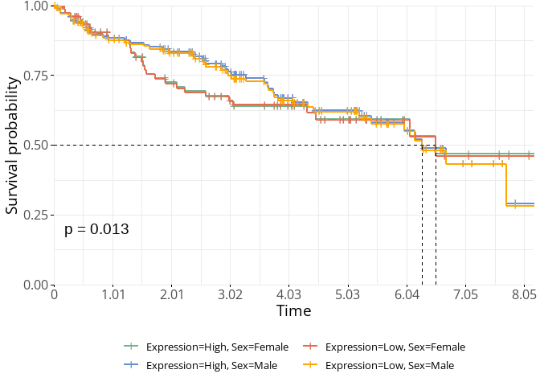
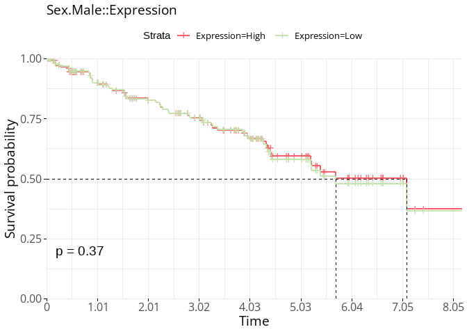
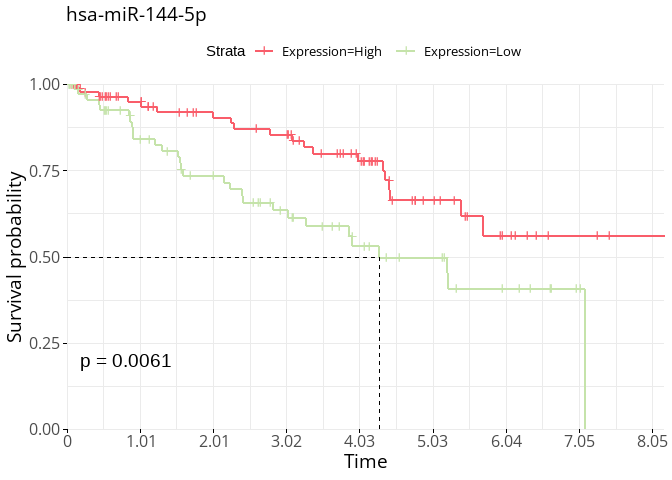

***

### 0.0 Introduction  

Here, we're going to plot the survival estimates of the oncofetal miRNAs we discovered in Script 5.  

***  

### 1.0 Loading Packages and Data  

Loading all of our packages:  


```r
library(magrittr)

# rmarkdown packages
library(knitr) 
library(rmarkdown)

# data wrangling packages
library(tidyverse)
library(janitor)

# data loading packages
library(readxl) 
library(openxlsx)
library(here)


# setting global script options - i.e, parameters/arguents that will be applied to all chunks, without having to explicity specify them each time
knitr::opts_chunk$set(warning = FALSE, message = FALSE, error = FALSE)
```

Reading in data:  


```r
pDat <- read_excel(here::here("data", "KIRC_pDat_replicates_removed.xlsx"))
eDat <- read_rds(here::here("data", "KIRC_eDat_replicates_removed.RDS"))
mDat <- read_rds(here::here("data", "KIRC_mDat.RDS"))

eNorm_c1 <- read_rds(here::here("data", "KIRC_eNorm_c1.RDS"))
eNorm_c2 <- read_rds(here::here("data", "KIRC_eNorm_c2.RDS"))

pval_mirs <-read_excel(here::here("data", "pval_mirs.xlsx"))
oncofetal_mirs_male <- read_excel(here::here("data", "oncofetal_mirs_male.xlsx"))
oncofetal_mirs_female <- read_excel(here::here("data", "oncofetal_mirs_female.xlsx"))
```

**Add your choice of font available at [Google Fonts](https://fonts.google.com/), and make your own customized ggplot2 theme**. We will now use this theme option for all future plots  


```r
library(showtext)
library(extrafont)
knitr::opts_chunk$set(fig.showtext = TRUE, fig_retina = 1) # needed to render show_text


font_add_google("Open Sans", "Sans")

# colpal <- list(Condition = c(`Fetal` = "#ECB576", `NM` = "#115363", `Tumour` = "#A34237"),
#                Sex = c(`Male` = "#E05D5D", `Female` = "#ffb708"),
#                Self_reported_race = c(`Black or African American` = "#9BBC49", 
#                                       `Asian` = "#5B8D33", 
#                                       `White` = "#286E16", 
#                                       `Not Reported` = "#666666"))
colpal <- list(Condition = c(`Fetal` = "#4D6DA0", `NM` = "#72B592", `Tumour` = "#C5E3AA"),
               Sex = c(`Male` = "#9dba8f", `Female` = "#edcba0"),
               Self_Reported_Race = c(`African American or Black` = "#698ECF", `American Indian or Alaska Native` = "#565199", `Asian` = "#E26E51", `Caucasian or White` = "#F6D076", `Not Reported/Unknown` = "#de425b"), 
               Self_reported_race = c(`Black or African American` = "#698ECF", `American Indian or Alaska Native` = "#565199", `Asian` = "#E26E51", `White` = "#F6D076", `Not Reported` = "#de425b"), category= c('50-55' = "#003f5c", '55-60' = "#2f4b7c", '60-65'="#665191", '65-70'="#a05195", '70-75'="#d45087", '75-80'="#f95d6a", '80-85'="#ff7c43", '85-90'="#ffa600", '90-95'="#F6D076", '95-100'="#C5E3AA"))


my_theme <- theme_minimal() +
  theme(plot.title = element_text(family = "Sans", size = 14),
        plot.subtitle = element_text(family = "Sans", size = 12),
        legend.text = element_text(family = "Sans", size = 10),
        axis.title = element_text(family = "Sans", size = 14),
        axis.text = element_text(family = "Sans", size = 12))


# needed to bind ggplot and our custom font
showtext_auto()
```

To plot the survival curves, we need two major variables:  


- `Expression` - a binary variable signifiying expression of each miRNA for each sample as being either high or low expression  
- `Time` measurement - here, either days to death since diagnosis for the deceased patients, or days to last follow up for the patients who were still alive at the end of the study  
- `Status` - alive or deceased  

We don't have either of the above 3 variables, but we can make the Expression variable, and download the Time and Status from online databases  

*** 

### 2.0 Median Expression  

For Expression, a general guide is to take the median expression of a miRNA (across all the samples) and signify whether expression is high or low per sample  


```r
library(Biobase)

pDat_Tumour_c1 <- pDat %>% 
  filter(Condition == "Tumour") %>% 
  filter(cluster_group == 1)

eNorm_median_c1 <- eNorm_c1 %>% 
  dplyr::select(pDat_Tumour_c1$Sample) %>%  # as we only use tumour samples in plotting survival
  mutate(Median = rowMedians(as.matrix(eNorm_c1))) %>% 
  dplyr::select(Median, everything())

eNorm_median_c1 <- eNorm_median_c1 %>% 
  rownames_to_column("miRNA") %>% 
  pivot_longer(cols = -c(Median, miRNA), names_to = "Sample", values_to = "Reads") %>% 
  mutate(Expression = case_when(
    Reads < Median ~ "Low", 
    Reads >= Median ~ "High"))
```


***

### 3.0 cDat

At this [link](https://www.cbioportal.org/study/clinicalData?id=kirc_tcga_pan_can_atlas_2018), you can find all of the clinical information about the KIRC dataset, but there exists a TCGA-specific R package that we can use to pull that information. We'll make a new df named cDat to store that info, and then join to pDat  


```r
# BiocManager::install("RTCGA")
# BiocManager::install("RTCGA.clinical")

library(RTCGA)
library(RTCGA.clinical)

cDat <- survivalTCGA(KIRC.clinical)

cDat <- cDat %>% 
  dplyr::rename("Time" = "times",
                "Status" = "patient.vital_status", 
                "Case_ID" = "bcr_patient_barcode") %>% 
  dplyr::select(Case_ID, everything())
```


```r
cDat <- cDat %>% 
  right_join(pDat, by = "Case_ID")
```

### 4.0 Survival Analysis

Now, we saw that we when we included both the sexes in our unstratified analysis, 81 of the miRNAs showed expression by our oncofetal criteria   


```r
oncofetal_mirs <- pval_mirs %>% 
  filter(pvals_NM_Tumour_adj <= 0.05 & pvals_NM_Fetal_adj <= 0.05 & pvals_Tumour_Fetal_adj >= 0.05)

nrow(oncofetal_mirs)
```

```
## [1] 81
```

We got 84 oncofetal miRNAs in male and 22 in females when we applied a sex-stratified approach  


```r
nrow(oncofetal_mirs_male)
```

```
## [1] 84
```

Let's now plot the surival estimates of these 84 miRNAs:  

First, we'll join the median expression and and Time and Status variables that we obtained


```r
surv_vars <- oncofetal_mirs_male %>% 
  dplyr::select(miRNA) %>% 
  left_join(eNorm_median_c1, by = "miRNA") %>% 
  left_join(cDat, by = "Sample") %>% 
  dplyr::select(Sample, Expression, Time, Status, miRNA, Sex, Self_reported_race) %>% 
  filter(!(is.na(Status)))

surv_vars$Expression <- as.factor(surv_vars$Expression)

surv_vars <- as.data.frame(surv_vars)
```

#### 4.1 Overall Survival

1. All 84 together (84 miRNA signature)  


```r
library(survival)
library(survminer)

# equation to estimate survival overall by expression
sfit_all <- survfit(data = surv_vars, Surv(Time, Status) ~ Expression)


ggsurvplot(sfit_all, 
           conf.int = FALSE, 
           pval = TRUE, 
           surv.median.line = "hv",
           xscale = 365,
           break.time.by = 3675/10,
           axes.offset = FALSE,
           palette = c("#f95d6a", "#C5E3AA"),
           ggtheme = my_theme)
```

<!-- -->

Okay, so the 84-miRNA signature in all patients together (males and females) is not significant - which is not surprising, as we did not actually get any oncofetal miRNAs in the unstratified approach.  


#### 4.2 Survival by Sex

Investigating the survival separately by sex:  


```r
sfit_sex <- survfit(data = surv_vars, Surv(Time, Status) ~ Expression + Sex)

p1 <- ggsurvplot(sfit_sex, 
           conf.int = FALSE, 
           pval = TRUE, 
           surv.median.line = "hv",
           xscale = 365,
           break.time.by = 3675/10,
           axes.offset = FALSE,
           palette = c("#72B592", "#698ECF", "#E26E51", "#ffa600"),
           legend = "bottom",
           ggtheme = my_theme)

p1$plot +
  theme(legend.title = element_blank()) +
  guides(colour = guide_legend(nrow = 2))
```

<!-- -->


Okay, we do see that the survival is showing significant difference when we split the male and female samples. Let's make the same exact graph, but split it into two, one each for males and females  


<!-- --><!-- -->

Okay, so what the two distinct and unsignificant survival plots are telling us in contrast to the plot above that has both the sex together is that while there is a significant difference in the survival using these 84 miRNAs overall in males and females, when investigated specifically within males or females, there is no difference 

Again, not surprising, as gene-signatures can or cannot be significant  

We'll investigate the survival of each of the 84 miRNAs separately now in males only, as we obtained these miRNAs from the male-stratified analysis,and check which of these are significant individually at predicting survival  


#### 4.3 Survival for individual miRNAs in Males  


1. Extracting the survival p-values for each of the 84  


```r
# selecting only the 15 significant miRNAs, and splitting up our survival dataframe by miRNA, so that each miRNA is its own dataframe  
surv_dat_list_males <- surv_vars %>% 
  filter(miRNA %in% oncofetal_mirs_male$miRNA) %>% 
  filter(Sex == "Male") %>%  # selecting only the male samples, as our 84 miRNAs came from male-only samples  
  split(as.factor(.$miRNA))


# making an empty list where we will store each of our pvalues per miRNA
sfit_pval_84_males <- list()


# a for-loop to iteratively apply the same exact function (here, extracting the pvalue from the survival output) over each miRNA df from the list above
for(i in seq_along(surv_dat_list_males)){
  
  sfit <- survfit(data = surv_dat_list_males[[i]], Surv(Time, Status) ~ Expression)
  
  pval <- surv_pvalue(sfit)
  
  # assigining the pvalue to the empty list that we made
  sfit_pval_84_males[[i]] <- pval
  
}

# adding the names from the miRNA survival dataframe to the corresponding pvalues
names(sfit_pval_84_males) <- names(surv_dat_list_males)
```


```r
# binding all pvals into one df
sfit_pval_84_males <- sfit_pval_84_males %>% 
  bind_rows() %>% 
  mutate(miRNA = names(surv_dat_list_males))


# selecting miRNAs with pvalue of <= 0.05
sfit_pval_sig_male <- sfit_pval_84_males %>% 
  filter(pval <= 0.05)


nrow(sfit_pval_sig_male)
```

```
## [1] 14
```

```r
#14
```

Okay, so we have 14 of the 84 miRNAs that seem to have a significant p-value for expression of that miRNA and survival probability  


2. Making survival plots for the 17 miRNAs with siginificant surival curves  


```r
# change the fig.height and fig.width if plot does not render in good dimensions 


# selecting only the 15 significant miRNAs, and splitting up our survival dataframe by miRNA, so that each miRNA is its own dataframe  
surv_dat_list_males_14 <- surv_vars %>% 
  filter(miRNA %in% sfit_pval_sig_male$miRNA) %>% 
  filter(Sex == "Male") %>%  # selecting only the male samples, as our 84 miRNAs came from male-only samples  
  split(as.factor(.$miRNA))

# making an empty list where we will store each of our plots
surv_dat_plots_male_14 <- list()


# a for-loop to iteratively apply the same exact function (here, making the survival plot) over each miRNA df from the list above
for(i in seq_along(surv_dat_list_males_14)){
  
  sfit <- survfit(data = surv_dat_list_males_14[[i]], Surv(Time, Status) ~ Expression)
  
  g1 <- ggsurvplot(sfit, 
           conf.int = FALSE, 
           pval = TRUE, 
           surv.median.line = "hv",
           xscale = 365,
           break.time.by = 3675/10,
           axes.offset = FALSE,
           palette = c("#f95d6a", "#C5E3AA"),
           ggtheme = my_theme)
  
  # appending plot title to name of the df, which is the name of the miRNA in this case
  g1$plot$labels$title <- (names(surv_dat_list_males_14[i]))
  
  # assigining the plot to the empty list that we made
  surv_dat_plots_male_14[[i]] <- g1
  
}

# adding the names from the miRNA survival dataframe to the corresponding plots
names(surv_dat_plots_male_14) <- names(surv_dat_list_males_14)

surv_dat_plots_male_14
```

```
## $`hsa-let-7f-5p`
```

<!-- -->

```
## 
## $`hsa-miR-101-5p`
```

<!-- -->

```
## 
## $`hsa-miR-144-3p`
```

<!-- -->

```
## 
## $`hsa-miR-151b`
```

<!-- -->

```
## 
## $`hsa-miR-221-3p`
```

<!-- -->

```
## 
## $`hsa-miR-25-3p`
```

<!-- -->

```
## 
## $`hsa-miR-30c-1-3p`
```

<!-- -->

```
## 
## $`hsa-miR-342-3p`
```

<!-- -->

```
## 
## $`hsa-miR-3613-5p`
```

<!-- -->

```
## 
## $`hsa-miR-365a-3p`
```

<!-- -->

```
## 
## $`hsa-miR-365b-3p`
```

<!-- -->

```
## 
## $`hsa-miR-550a-3p`
```

<!-- -->

```
## 
## $`hsa-miR-9-5p`
```

<!-- -->

```
## 
## $`hsa-miR-99a-5p`
```

<!-- -->


Okay, so we have 14 of the 84 miRNAs that seem to have a significant p-value for expression of that miRNA and survival probability  


**Now check within eNorm_c2 if we get these exact 13 miRNAs as having significant association with survival probability in males - i.e., are these 13 miRNAs that we found replicable in a different dataset?**  


```r
pDat_Tumour_c2 <- pDat %>% 
  filter(Condition == "Tumour") %>% 
  filter(cluster_group == 2)

eNorm_c2 <- eNorm_c2 %>% 
  column_to_rownames("miRNA")

eNorm_median_c2 <- eNorm_c2 %>% 
  dplyr::select(pDat_Tumour_c2$Sample) %>%  # as we only use tumour samples in plotting survival
  mutate(Median = rowMedians(as.matrix(eNorm_c2))) %>% 
  dplyr::select(Median, everything())

eNorm_median_c2 <- eNorm_median_c2 %>% 
  rownames_to_column("miRNA") %>% 
  pivot_longer(cols = -c(Median, miRNA), names_to = "Sample", values_to = "Reads") %>% 
  mutate(Expression = case_when(
    Reads < Median ~ "Low", 
    Reads >= Median ~ "High"))

#---------------------------------------------------------
 surv_vars_c2 <- oncofetal_mirs_male %>%
   dplyr::select(miRNA) %>%
   left_join(eNorm_median_c2, by = "miRNA") %>%
   left_join(cDat, by = "Sample") %>%
   dplyr::select(Sample, Expression, Time, Status, miRNA, Sex, Self_reported_race) %>%
   filter(!(is.na(Status)))

surv_vars_c2$Expression <- as.factor(surv_vars_c2$Expression)
#Warning: no non-missing arguments to max; returning -InfError in survfit.formula(data = surv_vars_c2, Surv(Time, Status) ~ Expression) :
 # data set has no non-missing observations

surv_vars_c2 <- as.data.frame(surv_vars_c2)

#---------------------------------------------------------

sfit_all_c2 <- survfit(data = surv_vars_c2, Surv(Time, Status) ~ Expression)


ggsurvplot(sfit_all, 
           conf.int = FALSE, 
           pval = TRUE, 
           surv.median.line = "hv",
           xscale = 365,
           break.time.by = 3675/10,
           axes.offset = FALSE,
           palette = c("#f95d6a", "#C5E3AA"),
           ggtheme = my_theme)
```

<!-- -->

```r
#------------------------------------------------------------

sfit_sex_c2 <- survfit(data = surv_vars_c2, Surv(Time, Status) ~ Expression + Sex)

p1_c2 <- ggsurvplot(sfit_sex_c2, 
           conf.int = FALSE, 
           pval = TRUE, 
           surv.median.line = "hv",
           xscale = 365,
           break.time.by = 3675/10,
           axes.offset = FALSE,
           palette = c("#72B592", "#698ECF", "#E26E51", "#ffa600"),
           legend = "bottom",
           ggtheme = my_theme)

p1_c2$plot +
  theme(legend.title = element_blank()) +
  guides(colour = guide_legend(nrow = 2))
```

<!-- -->

```r
#------------------------------------------------------------
ggsurv_sex_c2 <- ggsurvplot_group_by(sfit_all, 
                                  surv_vars_c2, 
                                  group.by = "Sex", 
                                  pval = TRUE, 
                                  surv.median.line = "hv", 
                                  xscale = 365, 
                                  break.time.by = 3675/10, 
                                  axes.offset = FALSE,
                                  palette = c("#f95d6a", "#C5E3AA"),
                                  ggtheme = my_theme)


ggsurv_sex_c2$`Sex.Female::Expression`$plot
```

<!-- -->

```r
ggsurv_sex_c2$`Sex.Male::Expression`$plot
```

<!-- -->

```r
#------------------------------------------------------------

# selecting only the significant miRNAs, and splitting up our survival dataframe by miRNA, so that each miRNA is its own dataframe  
surv_dat_list_males_c2 <- surv_vars_c2 %>% 
  filter(miRNA %in% oncofetal_mirs_male$miRNA) %>% 
  filter(Sex == "Male") %>%  # selecting only the male samples, as our 84 miRNAs came from male-only samples  
  split(as.factor(.$miRNA))


# making an empty list where we will store each of our pvalues per miRNA
sfit_pval_blank_males_c2 <- list()


# a for-loop to iteratively apply the same exact function (here, extracting the pvalue from the survival output) over each miRNA df from the list above
for(i in seq_along(surv_dat_list_males_c2)){
  
  sfit_c2 <- survfit(data = surv_dat_list_males_c2[[i]], Surv(Time, Status) ~ Expression)
  
  pval_c2 <- surv_pvalue(sfit_c2)
  
  # assigining the pvalue to the empty list that we made
  sfit_pval_blank_males_c2[[i]] <- pval_c2
  
}

# adding the names from the miRNA survival dataframe to the corresponding pvalues
names(sfit_pval_blank_males_c2) <- names(surv_dat_list_males_c2)

#-----------------------------------------------------------------

# binding all pvals into one df
sfit_pval_blank_males_c2 <- sfit_pval_blank_males_c2 %>% 
  bind_rows() %>% 
  mutate(miRNA = names(surv_dat_list_males_c2))


# selecting miRNAs with pvalue of <= 0.05
sfit_pval_sig_male_c2 <- sfit_pval_blank_males_c2 %>% 
  filter(pval <= 0.05)


nrow(sfit_pval_sig_male_c2)
```

```
## [1] 12
```

```r
#--------------------------------------------------------------
# selecting only the 15 significant miRNAs, and splitting up our survival dataframe by miRNA, so that each miRNA is its own dataframe  
surv_dat_list_males_12 <- surv_vars_c2 %>% 
  filter(miRNA %in% sfit_pval_sig_male_c2$miRNA) %>% 
  filter(Sex == "Male") %>%  # selecting only the male samples, as our 84 miRNAs came from male-only samples  
  split(as.factor(.$miRNA))

# making an empty list where we will store each of our plots
surv_dat_plots_male_12 <- list()


# a for-loop to iteratively apply the same exact function (here, making the survival plot) over each miRNA df from the list above
for(i in seq_along(surv_dat_list_males_12)){
  
  sfit_c2 <- survfit(data = surv_dat_list_males_12[[i]], Surv(Time, Status) ~ Expression)
  
  g1_c2 <- ggsurvplot(sfit_c2, 
           conf.int = FALSE, 
           pval = TRUE, 
           surv.median.line = "hv",
           xscale = 365,
           break.time.by = 3675/10,
           axes.offset = FALSE,
           palette = c("#f95d6a", "#C5E3AA"),
           ggtheme = my_theme)
  
  # appending plot title to name of the df, which is the name of the miRNA in this case
  g1_c2$plot$labels$title <- (names(surv_dat_list_males_12[i]))
  
  # assigining the plot to the empty list that we made
  surv_dat_plots_male_12[[i]] <- g1_c2
  
}

# adding the names from the miRNA survival dataframe to the corresponding plots
names(surv_dat_plots_male_12) <- names(surv_dat_list_males_12)

surv_dat_plots_male_12
```

```
## $`hsa-miR-125a-5p`
```

<!-- -->

```
## 
## $`hsa-miR-139-3p`
```

<!-- -->

```
## 
## $`hsa-miR-139-5p`
```

<!-- -->

```
## 
## $`hsa-miR-144-3p`
```

<!-- -->

```
## 
## $`hsa-miR-144-5p`
```

<!-- -->

```
## 
## $`hsa-miR-16-5p`
```

<!-- -->

```
## 
## $`hsa-miR-221-3p`
```

<!-- -->

```
## 
## $`hsa-miR-23b-5p`
```

<!-- -->

```
## 
## $`hsa-miR-451a`
```

<!-- -->

```
## 
## $`hsa-miR-590-3p`
```

<!-- -->

```
## 
## $`hsa-miR-9-5p`
```

<!-- -->

```
## 
## $`hsa-miR-92b-3p`
```

<!-- -->

```r
#checking unique and common elements 
common_elements <- intersect(sfit_pval_sig_male$miRNA, sfit_pval_sig_male_c2$miRNA)

cat(common_elements)
```

```
## hsa-miR-144-3p hsa-miR-221-3p hsa-miR-9-5p
```

```r
unique_in_c1 <- setdiff(sfit_pval_sig_male$miRNA, sfit_pval_sig_male_c2$miRNA)
unique_in_c2 <- setdiff(sfit_pval_sig_male_c2$miRNA, sfit_pval_sig_male$miRNA)

cat(unique_in_c1)
```

```
## hsa-let-7f-5p hsa-miR-101-5p hsa-miR-151b hsa-miR-25-3p hsa-miR-30c-1-3p hsa-miR-342-3p hsa-miR-3613-5p hsa-miR-365a-3p hsa-miR-365b-3p hsa-miR-550a-3p hsa-miR-99a-5p
```

```r
cat(unique_in_c2)
```

```
## hsa-miR-125a-5p hsa-miR-139-3p hsa-miR-139-5p hsa-miR-144-5p hsa-miR-16-5p hsa-miR-23b-5p hsa-miR-451a hsa-miR-590-3p hsa-miR-92b-3p
```

```r
eNorm_c1 <- eNorm_c1 %>% 
  rownames_to_column("miRNA")
  
eNorm_c1_long <- eNorm_c1 %>%
  pivot_longer(cols = -c(miRNA), names_to = "Sample", values_to = "Reads")

eNorm_c1_long <- eNorm_c1_long %>% 
  left_join(pDat, by = "Sample")

eNorm_c2 <- eNorm_c2 %>% 
  rownames_to_column("miRNA")

eNorm_c2_long <- eNorm_c2 %>%
  pivot_longer(cols = -c(miRNA), names_to = "Sample", values_to = "Reads")

eNorm_c2_long <- eNorm_c2_long %>% 
  left_join(pDat, by = "Sample")

b1 <- eNorm_c1_long %>% 
  ggplot(aes(x = Condition, y = "hsa-miR-144-3p", fill = Condition, colour = Condition)) +
  geom_boxplot(alpha = 0.6) +
  scale_fill_manual(values = c("#de425b","#698ECF","#72B592")) +
  # scale_colour_manual(values = colpal$Condition) +
  labs(title = "KIRC: C1 Normalized Expression Data") +
  theme_minimal()

b2 <- eNorm_c1_long %>% 
  ggplot(aes(x = Condition, y = "hsa-miR-221-3p", fill = Condition, colour = Condition)) +
  geom_boxplot(alpha = 0.6) +
  scale_fill_manual(values = c("#de425b","#698ECF","#72B592")) +
  # scale_colour_manual(values = colpal$Condition) +
  labs(title = "KIRC: C1 Normalized Expression Data") +
  theme_minimal()

b3 <- eNorm_c1_long %>% 
  ggplot(aes(x = Condition, y = "hsa-miR-9-5p", fill = Condition, colour = Condition)) +
  geom_boxplot(alpha = 0.6) +
  scale_fill_manual(values = c("#de425b","#698ECF","#72B592")) +
  # scale_colour_manual(values = colpal$Condition) +
  labs(title = "KIRC: C1 Normalized Expression Data") +
  theme_minimal()

b4 <- eNorm_c2_long %>% 
  ggplot(aes(x = Condition, y = "hsa-miR-144-3p", fill = Condition, colour = Condition)) +
  geom_boxplot(alpha = 0.6) +
  scale_fill_manual(values = c("#de425b","#698ECF","#72B592")) +
  # scale_colour_manual(values = colpal$Condition) +
  labs(title = "KIRC: C2 Normalized Expression Data") +
  theme_minimal()

b5 <- eNorm_c2_long %>% 
  ggplot(aes(x = Condition, y = "hsa-miR-221-3p", fill = Condition, colour = Condition)) +
  geom_boxplot(alpha = 0.6) +
  scale_fill_manual(values = c("#de425b","#698ECF","#72B592")) +
  # scale_colour_manual(values = colpal$Condition) +
  labs(title = "KIRC: C2 Normalized Expression Data") +
  theme_minimal()

b6 <- eNorm_c2_long %>% 
  ggplot(aes(x = Condition, y = "hsa-miR-9-5p", fill = Condition, colour = Condition)) +
  geom_boxplot(alpha = 0.6) +
  scale_fill_manual(values = c("#de425b","#698ECF","#72B592")) +
  # scale_colour_manual(values = colpal$Condition) +
  labs(title = "KIRC: C2 Normalized Expression Data") +
  theme_minimal()

ggarrange(b1, b4, b2, b5, b3, b6, nrow = 3, ncol = 2)
```

<!-- -->

```r
#hsa-miR-144-3p hsa-miR-221-3p hsa-miR-9-5p
```

***

End of Script  

***
